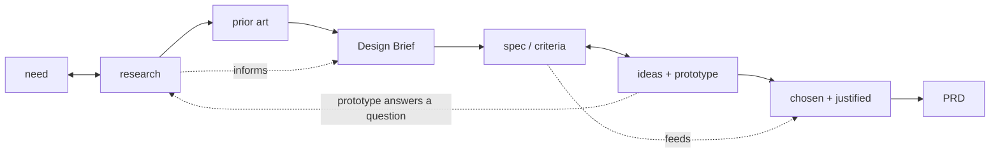

# Structured Workflow Scratchpad

Temporary planning notes. Delete this file after the README and final project
docs have absorbed the useful context.

Inquiry-Analysis is now written up as a self-contained phase doc:
`skills/inquiry-analysis/README.md`. This scratchpad keeps the source research,
the cross-phase artifact flow, the adversarial-review concept, and the remaining
open threads.

## Naming Decisions To Preserve

Structured Workflow should not expose source-system names as the active product
surface.

- Matt `grill-with-docs` maps to Structured Workflow `Interview`.
- Matt `CONTEXT.md` (glossary-only) maps to Structured Workflow `GLOSSARY.md`.
- Matt `CONTEXT-MAP.md` maps to `GLOSSARY-MAP.md`, only when multiple glossary
  contexts are needed.
- Matt's ubiquitous-language idea maps to resolving ambiguity between human,
  agent, artifacts, tests, code, and reviews.

## MYP Strand Structure (grounded in the design-cycle diagrams)

Verified against the Criterion A and Criterion B diagrams on the Design and
Inquiry site (Aidan Hammond). Each criterion has four strands, and **the first
three strands produce the fourth — and the fourth is the handoff artifact.** The
structure is symmetric across phases:

```text
A1 need      \
A2 research   } -> A4 Design Brief   (summarizes A1-A3)
A3 prior art /

B1 spec/criteria \
B2 ideas+prototype } -> B4 PRD       (the requirements for creating the chosen
B3 chosen+justified/                  solution; "planning drawings" reinterpreted
                                      per task: API contracts, schema, test seams)
```

The dotted arrows are the intrinsic back-and-forth (research feeds every strand;
specs and ideas interplay; a prototype can throw a question back to inquiry):


<!-- A = inquiry strands, B = developing-ideas strands. Dotted = the back-and-forth. -->

Key reads from the diagrams (these justify the fluid, non-gated model):

- **The back-and-forth is drawn into the structure, not a caveat.** A2 (Research)
  arrows point both ways — back to A1 and forward through A3 to A4 ("Research
  informs the other steps of Criterion A"). B1 <-> B2 is bidirectional, with a
  curved arrow from B1 back into B3. Nothing is final until the whole criterion
  settles.
- **The prototype move is native to B2.** B2 is wrapped in an "Explore ideas /
  Test ideas / Gather feedback" box — that IS the prototype-to-answer move. It
  lives in developing-ideas but is reachable early, even mid-inquiry: you can
  start researching, realize you need a develop-ideas prototype to get feedback
  on a direction *before* the questions are answered and B1 specs can be written,
  then carry the answer back.
- **B1-B3 are the pieces of the PRD; B4 is the synthesized whole.** Once all of B
  is done you have a holistic PRD. The interview/grill continues into B but with
  narrower focus and only a few decisions left — or we arrive here via a
  prototype. Same engine, less open surface.

## Orientation, Not a Hard Gate (decided)

Reframed the "75% -> write the artifact" idea: it is **orientation toward a
target artifact, not an enforced gate.** At any moment the agent knows which
phase it is in and which artifact it is moving toward (Design Brief in inquiry,
PRD in developing-ideas). When open questions thin out and no *blocking* question
remains, the agent **offers** to synthesize the target artifact rather than
grilling forever (the fix for `grill-with-docs` having no terminator). It offers;
it does not block. No hard wall between inquiry and developing-ideas.

## Durable Files Decision: `workflow-tracker.md`

The always-on phase-state file is **`workflow-tracker.md`** (name locked; not
`CYCLE.md`). It is a peer to `GLOSSARY.md` — always on, re-read at phase entry —
and records where the work is in the cycle: current phase, likely next phase, and
whether we are looping back. It is what makes the oscillation safe and survives
context loss. (Lineage: planning-with-files `progress.md`, but renamed and scoped
to phase-position only — NOT the `task_plan/progress/findings` triad.)

Open: whether `workflow-tracker.md` is fully specified inside the developing-ideas
doc or written up separately as a cross-phase concept (it spans all four phases,
like `GLOSSARY.md`). Leaning cross-phase.

## Inquiry-Analysis (migrated)

The core thesis, the Interview-as-engine framing, the interview loop, the
endpoint gate, the inquiry document shape, and the Design Brief review now live
in `skills/inquiry-analysis/README.md`. The source research that fed them is
kept below.

## Source Ingredients (from the real skills)

Each favorite contributes one distinct ingredient. They are parts of one phase,
not alternatives.

### grill-with-docs / grill-me (Matt Pocock) — the engine

Source: `~/.agents/skills/grill-with-docs/SKILL.md`, `.../grill-me/SKILL.md`.

- Interview relentlessly; walk the design tree one branch at a time, resolving
  dependent decisions in order; give a recommended answer per question.
- Ask one question at a time; if the codebase can answer it, explore instead.
- Challenge the user's wording against the glossary; sharpen fuzzy/overloaded
  terms; stress-test with concrete scenarios; cross-reference against code.
- Update `GLOSSARY.md` inline as terms resolve (glossary-only, no implementation
  detail). Offer ADRs sparingly: only hard-to-reverse + surprising + real
  trade-off.
- `grill-me` is the no-docs fallback when there is no domain surface yet.

### Superpowers brainstorming — the hard gate

Source: `github.com/obra/superpowers` `skills/brainstorming/SKILL.md`.

- Ordered checklist: explore context -> (offer visual companion) -> clarifying
  questions one at a time -> propose 2-3 approaches -> present design in
  sections with approval after each -> write design doc -> spec self-review ->
  user reviews spec -> transition to planning.
- HARD GATE: do not code/scaffold/invoke implementation until a design is
  presented and approved. Applies to every project, "too simple" included.
- Spec self-review scans for placeholders, contradictions, scope, ambiguity.
- It bundles a lot into one skill: not just inquiry and the 2-3-approaches
  idea-generation, but the full technical design/spec — architecture,
  components, data flow, error handling, testing. In our four buckets that one
  source skill spans all of `inquiry-analysis` AND `developing-ideas`.
- Scope-decomposition: if the request is several independent subsystems, it
  stops and decomposes into sub-projects first, each getting its own
  spec -> plan -> implementation cycle. (Converges with VGV's Step 0 "is this
  even one project?" check.)

### VGV Wingspan brainstorm — phase discipline + the clarity gate

Source: `github.com/VeryGoodOpenSource/vgv-wingspan` `skills/brainstorm/SKILL.md`.

- Clarify WHAT before HOW. Step 0 assesses scope (new project vs feature).
- Up-front CLARITY GATE (0.1): if requirements are already clear, skip
  brainstorm and suggest going straight to planning. Brainstorm only when there
  is real ambiguity.
- Lightweight project research first; collaborative Q&A one at a time
  (multiple-choice preferred, broad -> narrow, success criteria early).
- 2-3 concrete approaches with trade-offs, lead with a recommendation; YAGNI
  ruthlessly, prefer boring/existing patterns, right-size architecture.
- Capture a dated brainstorm doc, then an explicit handoff that can **clear
  context** before planning. DO NOT CODE.

### ACT spec-writing / refine-spec — output shape + adversarial review

Source: `~/.agentic-coding-toolkit/skills/act-workflow-spec`, `.../refine-spec`.

- Spec dimensions: goal, scope, user flows (with a permutation checklist:
  first-time vs returning, offline/slow, partial/resume, cancel/rollback,
  concurrency), constraints, edge cases, validation, codebase context.
- Preview-outline gate before writing the full spec.
- `refine-spec` is an adversarial reviewer: review-only first, no silent edits,
  five dimensions (completeness, assumptions, UX coherence, data model, codebase
  alignment), findings by severity, then a review gate.

## Adversarial Review (cross-phase concept)

Every steering artifact is untrusted until an adversarial review pass clears it.
This is a cross-phase pattern: the Design Brief (inquiry-analysis), the PRD
(developing-ideas), and the implementation plan / code (creating-solution,
evaluating) all face the same discipline. First instance is written up in
`skills/inquiry-analysis/README.md`.

The shared shape (grounded in the real sources):

- **Spawn focused reviewers in parallel**, each with one lens, judging the
  artifact against an explicit criteria set. *(VGV `plan-technical-review` runs
  `@code-simplicity-review-agent`, `@vgv-review-agent`, `@plan-splitting-agent`
  in parallel.)*
- **Criteria are explicit and named.** VGV `refine-approach`: Clarity,
  Completeness, Specificity, YAGNI, Scope. VGV `@vgv-review-agent`: Very Good
  Engineering practices. ACT `refine-spec`: completeness, assumptions, UX
  coherence, data model, codebase alignment.
- **Review first, no silent edits.** The pass produces findings; it does not
  quietly rewrite the artifact.
- **Findings by severity**, with one prominent **must-address** item.
- **A gate, not a rubber stamp.** Blocking findings route back; the artifact is
  not downstream authority until it passes.
- **Bounded iteration** — ~2 passes, then complete or escalate.

Open question: our own criteria set / "engineering principles" equivalent.
VGV anchors on Very Good Engineering; we need our named principles (likely the
`ENGINEERING.md` lineage) before the review agents have something to judge
against. Park until we shape `evaluating`.

## Phase Artifact Flow (verified)

Each phase ends by producing one durable document. That document is what the
next phase reads. The documents ARE the cross-phase memory — not a separate
handoff step.

```text
inquiry-analysis   -> inquiry document (full findings step by step; its final
                                       Design Brief section is the handoff)
developing-ideas   -> PRD            (solution, user stories, implementation
                                       decisions, testing decisions, out of scope)
creating-solution  -> code + tests   (entered by slicing the PRD into issues)
evaluating         -> review/evidence
```

Verified against the real skills:

- **PRD is interview-free.** Matt `to-prd`: "Do NOT interview the user — just
  synthesize what you already know." The interviewing happened in
  inquiry-analysis, so developing-ideas synthesizes rather than re-asks. PRD
  shape: Problem / Solution / User Stories / Implementation Decisions / Testing
  Decisions / Out of Scope / Notes.
- **Creating-solution starts by decomposing the PRD.** Matt `to-issues` breaks
  "a plan, spec, or PRD" into tracer-bullet vertical slices: each cuts through
  all layers, is demoable on its own, and is marked HITL or AFK.

Nuances to respect:

- "Interview-free" is precise about PRD *synthesis*. Developing-ideas still has
  an approval gate when choosing among the 2-3 approaches, and `to-issues`
  quizzes the user on slice granularity. These are confirmations, not
  requirements interviews.
- Design-brief vs PRD overlap — **resolved via the MYP spine.** They are not
  competitors and do not duplicate: Design Brief = MYP A4, the *summary of the
  problem* (justified need + research + prior-art constraints) — the what/why,
  output of inquiry. PRD = MYP B4, the *requirements for creating the chosen
  solution* — the solution/how, output of developing-ideas. The Brief is an
  *input* to the PRD, not a lightweight version of it. `to-prd` confirms the
  seam: by PRD time, "do NOT interview — synthesize what you already know,"
  because the interviewing already produced the Brief. A clearly-specified
  request may still skip the Brief and route straight to the PRD (clarity gate),
  but they never collapse into each other.

Durable files vs handoff:

- The phase artifacts (brief -> PRD -> issues) plus the always-on `GLOSSARY.md`
  are the durable memory. The `handoff` skill is lightweight glue for clearing
  context mid-phase, not the primary continuity mechanism.
- This only works if files are written at the right moment, re-read at phase
  entry, kept bounded, and never duplicated.

## Open Threads (follow later, do not chase now)

1. **Inquiry <-> Developing-Ideas oscillation — model decided, mechanics TBD.**
   The MYP diagrams show the back-and-forth is intrinsic (see "MYP Strand
   Structure" above): B2's "Explore / Test / Gather feedback" box is the
   prototype-to-answer move, reachable mid-inquiry. The model: no hard wall;
   `workflow-tracker.md` records position and loop-backs; the agent orients
   toward the target artifact and offers to synthesize when blocking questions
   are gone. Still to write up: the concrete prototype jump-and-return mechanics
   (throwaway code answers one question, answer captured durably, prototype
   deleted).

2. **Gate inventory — leaning soft.** Gates found: clarity gate (entry to
   inquiry, skip when already clear — VGV); endpoint gate (exit of inquiry);
   approval gate (choosing an approach in developing-ideas — Superpowers/VGV);
   slice-approval gate (entry to creating-solution — `to-issues`). Superpowers
   enforces an absolute pre-implementation gate even for "simple" work. **Current
   direction: no hard gate** — orientation toward the target artifact instead
   (see "Orientation, Not a Hard Gate"). The agent offers; it does not block.
   Still to decide: whether ANY gate stays mandatory (likely the
   pre-implementation one at the creating-solution boundary).
