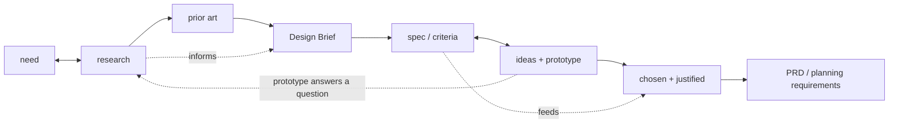

# Structured Workflow Scratchpad

Temporary planning notes. Delete this file after the README and final project
docs have absorbed the useful context.

Inquiry-Analysis and Developing-Ideas are now written up as self-contained phase
docs: `skills/inquiry-analysis/README.md` and `skills/developing-ideas/README.md`.
The cross-phase position file has a starter template at
`workflow-management/workflow-tracker.md`. This scratchpad keeps the source
research, the cross-phase artifact flow, the adversarial-review concept, and the
remaining open threads.

Developing-Ideas decisions baked into its README: the engine is "generate options,
then choose against criteria" (solution-space questions, NOT a narrowed problem
interview); document follows MYP Criterion B (Design Specifications / Feasible
Ideas / Chosen Design / PRD), with the PRD as the interview-free synthesis and
handoff; prototype-to-answer jump; adversarial review of the PRD; orientation not
a hard gate. Human-ready/agent-ready and confidence signaling are included but
explicitly marked PROVISIONAL (under review), per decision.

## Cross-Phase Collaboration Principles

DONE: both principles are now in the core README as "Working Together: Judgment
and Confidence" (no longer provisional). The developing-ideas doc references them
rather than redefining them. Notes below kept as the source rationale.

### Human-ready vs agent-ready work

Borrow the HITL/AFK distinction from Matt Pocock's issue-slicing workflow, but
make it a general Structured Workflow concept:

- **Human-ready** work needs human judgment before the agent proceeds. Examples:
  choosing among viable approaches, approving a design direction, resolving a
  value trade-off, confirming scope, accepting a risk, or deciding whether a
  prototype answer is good enough.
- **Agent-ready** work can be done while the human is AFK because the success
  criteria, inputs, constraints, and verification path are clear enough. Examples:
  source research, codebase inspection, drafting from already-approved material,
  running checks, generating an evidence summary, or slicing an approved PRD into
  implementation issues.

The workflow should label work this way whenever it hands off, creates issues,
or proposes next steps. This prevents the agent from treating human judgment as
implementation detail, and prevents the human from staying unnecessarily in the
loop for work that is already well bounded.

### Confidence scoring as anti-surrender design

Source: `COGNATIVE_SURRENDER.md`.

The key risk is not just that agents can be wrong; it is that they can be wrong
fluently and authoritatively, causing humans to accept the output with too little
critical evaluation. The workflow should counter this by requiring the agent to
state confidence and evidence quality plainly.

Every meaningful claim, recommendation, handoff artifact, and review finding
should carry a practical confidence signal:

- **High confidence** — grounded in current repo evidence, direct source
  material, passing verification, or explicit human confirmation.
- **Medium confidence** — plausible synthesis from partial evidence; enough to
  proceed, but should stay easy to revise.
- **Low confidence** — weak evidence, missing source access, unresolved
  ambiguity, inferred intent, or a claim that needs human or external
  verification before downstream work relies on it.

The agent should say why it chose that confidence level and what would raise it.
This keeps the human in the reasoning loop, reduces confidence inflation, and
makes it normal to challenge the agent instead of treating fluent output as
settled truth.

When confidence is not high, the agent should explicitly ask the human to verify
the specific weak point:

```text
Please verify: <claim/assumption/decision>.
My source: <file/source/link/evidence>.
Why verification is needed: <missing evidence, inference, or risk>.
```

This turns uncertainty into a collaboration point instead of burying it in
polished prose.

## Naming Decisions To Preserve

Structured Workflow should not expose source-system names as the active product
surface.

- Matt `grill-with-docs` maps to Structured Workflow `Interview`.
- Matt `CONTEXT.md` (glossary-only) maps to Structured Workflow `GLOSSARY.md`.
- Matt `CONTEXT-MAP.md` maps to `GLOSSARY-MAP.md`, only when multiple glossary
  contexts are needed.
- Matt's ubiquitous-language idea maps to resolving ambiguity between human,
  agent, artifacts, tests, code, and reviews.

## MYP Strand Structure (grounded in the design-cycle diagrams)

Verified against the Criterion A and Criterion B diagrams on the Design and
Inquiry site (Aidan Hammond). Each criterion has four strands, and **the first
three strands produce the fourth — and the fourth is the handoff artifact.** The
structure is symmetric across phases:

```text
A1 need      \
A2 research   } -> A4 Design Brief   (summarizes A1-A3)
A3 prior art /

B1 spec/criteria \
B2 ideas+prototype } -> B4 PRD/export (the requirements for creating the chosen
B3 chosen+justified/                   solution; "planning drawings" reinterpreted
                                       per task: API contracts, schema, test seams)
```

The dotted arrows are the intrinsic back-and-forth (research feeds every strand;
specs and ideas interplay; a prototype can throw a question back to inquiry):


<!-- A = inquiry strands, B = developing-ideas strands. Dotted = the back-and-forth. -->

Key reads from the diagrams (these justify the fluid, non-gated model):

- **The back-and-forth is drawn into the structure, not a caveat.** A2 (Research)
  arrows point both ways — back to A1 and forward through A3 to A4 ("Research
  informs the other steps of Criterion A"). B1 <-> B2 is bidirectional, with a
  curved arrow from B1 back into B3. Nothing is final until the whole criterion
  settles.
- **The prototype move is native to B2.** B2 is wrapped in an "Explore ideas /
  Test ideas / Gather feedback" box — that IS the prototype-to-answer move. It
  lives in developing-ideas but is reachable early, even mid-inquiry: you can
  start researching, realize you need a develop-ideas prototype to get feedback
  on a direction *before* the questions are answered and B1 specs can be written,
  then carry the answer back.
- **B1-B4 are the internal structure of one `developing-ideas` document.** B1
  turns the Design Brief into design specifications. B2 explores feasible ideas
  through sketching/prototyping/testing/feedback. B3 presents and justifies the
  chosen design against the specifications. B4 captures the planning
  drawings/diagrams and creation requirements. For software, B4 is the PRD/export
  surface that can be mirrored to Linear or another issue tracker for issue
  decomposition.

## Orientation, Not a Hard Gate (decided)

Reframed the "75% -> write the artifact" idea: it is **orientation toward a
target artifact, not an enforced gate.** At any moment the agent knows which
phase it is in and which phase document/criterion it is moving toward (Design
Brief in inquiry, B4/PRD content inside developing-ideas). When open questions
thin out and no *blocking* question remains, the agent **offers** to synthesize
the target artifact rather than grilling forever (the fix for `grill-with-docs`
having no terminator). It offers; it does not block. No hard wall between
inquiry and developing-ideas.

## Durable Files Decision: `workflow-tracker.md`

The always-on phase-state file is **`workflow-tracker.md`**. It is a peer to
`GLOSSARY.md` — always on, re-read at phase entry — and records where the work is
in the design cycle: current phase, current phase document, current criterion,
linked upstream/downstream artifacts, likely next phase, and whether we are
looping back. It is what makes the oscillation safe and survives context loss.
(Lineage: planning-with-files `progress.md`, but renamed and scoped to
design-cycle position only — NOT the `task_plan/progress/findings` triad.)

Decided: `workflow-tracker.md` is cross-phase. A short template now lives at
`workflow-management/workflow-tracker.md` (folder name locked: `workflow-management/`,
distinct from the `skills/` phase docs; it holds the files that manage the
workflow — tracker now, glossary/engineering principles later). The
developing-ideas doc references it but does not fully define it.

## Inquiry-Analysis (migrated)

The core thesis, the Interview-as-engine framing, the interview loop, the
endpoint gate, the inquiry document shape, and the Design Brief review now live
in `skills/inquiry-analysis/README.md`. The source research that fed them is
kept below.

## Source Ingredients (from the real skills)

Each favorite contributes one distinct ingredient. They are parts of one phase,
not alternatives.

### grill-with-docs / grill-me (Matt Pocock) — the engine

Source: `~/.agents/skills/grill-with-docs/SKILL.md`, `.../grill-me/SKILL.md`.

- Interview relentlessly; walk the design tree one branch at a time, resolving
  dependent decisions in order; give a recommended answer per question.
- Ask one question at a time; if the codebase can answer it, explore instead.
- Challenge the user's wording against the glossary; sharpen fuzzy/overloaded
  terms; stress-test with concrete scenarios; cross-reference against code.
- Update `GLOSSARY.md` inline as terms resolve (glossary-only, no implementation
  detail). Offer ADRs sparingly: only hard-to-reverse + surprising + real
  trade-off.
- `grill-me` is the no-docs fallback when there is no domain surface yet.

### Superpowers brainstorming — the hard gate

Source: `github.com/obra/superpowers` `skills/brainstorming/SKILL.md`.

- Ordered checklist: explore context -> (offer visual companion) -> clarifying
  questions one at a time -> propose 2-3 approaches -> present design in
  sections with approval after each -> write design doc -> spec self-review ->
  user reviews spec -> transition to planning.
- HARD GATE: do not code/scaffold/invoke implementation until a design is
  presented and approved. Applies to every project, "too simple" included.
- Spec self-review scans for placeholders, contradictions, scope, ambiguity.
- It bundles a lot into one skill: not just inquiry and the 2-3-approaches
  idea-generation, but the full technical design/spec — architecture,
  components, data flow, error handling, testing. In our four buckets that one
  source skill spans all of `inquiry-analysis` AND `developing-ideas`.
- Scope-decomposition: if the request is several independent subsystems, it
  stops and decomposes into sub-projects first, each getting its own
  spec -> plan -> implementation cycle. (Converges with VGV's Step 0 "is this
  even one project?" check.)

### VGV Wingspan brainstorm — phase discipline + the clarity gate

Source: `github.com/VeryGoodOpenSource/vgv-wingspan` `skills/brainstorm/SKILL.md`.

- Clarify WHAT before HOW. Step 0 assesses scope (new project vs feature).
- Up-front CLARITY GATE (0.1): if requirements are already clear, skip
  brainstorm and suggest going straight to planning. Brainstorm only when there
  is real ambiguity.
- Lightweight project research first; collaborative Q&A one at a time
  (multiple-choice preferred, broad -> narrow, success criteria early).
- 2-3 concrete approaches with trade-offs, lead with a recommendation; YAGNI
  ruthlessly, prefer boring/existing patterns, right-size architecture.
- Capture a dated brainstorm doc, then an explicit handoff that can **clear
  context** before planning. DO NOT CODE.

### ACT spec-writing / refine-spec — output shape + adversarial review

Source: `~/.agentic-coding-toolkit/skills/act-workflow-spec`, `.../refine-spec`.

- Spec dimensions: goal, scope, user flows (with a permutation checklist:
  first-time vs returning, offline/slow, partial/resume, cancel/rollback,
  concurrency), constraints, edge cases, validation, codebase context.
- Preview-outline gate before writing the full spec.
- `refine-spec` is an adversarial reviewer: review-only first, no silent edits,
  five dimensions (completeness, assumptions, UX coherence, data model, codebase
  alignment), findings by severity, then a review gate.

## Developing-Ideas Research Evidence (2026-06-05)

Purpose of this pass: identify which source skills especially belong to
`inquiry-analysis` and `developing-ideas`, with concrete evidence. This is source
research only; final product docs should still use our names, not source-system
names.

Sources checked:

- Local Matt skills: `grill-with-docs`, `grill-me`, `ubiquitous-language`,
  `to-prd`, `prototype`, `to-issues`.
- Local ACT skills: `act-workflow-spec`, `act-workflow-refine-spec`,
  `act-workflow-plan`, `act-workflow-work`.
- Live VGV Wingspan: README plus `brainstorm`, `plan`, `refine-approach`,
  `plan-technical-review`.
- Live Superpowers: `brainstorming`, `writing-plans`, and skill inventory.
- Live VGV AI Flutter Plugin: README and skill inventory.
- Live Cursor Team Kit: README, skill/agent inventory, `verify-this`,
  `control-cli`, `control-ui`, `workflow-from-chats`,
  `thermo-nuclear-code-quality-review`.
- Local Codex Product Design plugin:
  `/Users/jholt/.codex/plugins/cache/openai-curated-remote/product-design/0.1.42`
  README plus `user-context`, `get-context`, `research`, `ideate`,
  `prototype`, `audit`, `design-qa`, and `critical-overrides`.

### Product Design ideas to preserve

The Codex Product Design plugin contributes several concrete workflow ideas that
fit our first two buckets without requiring us to copy its product surface.

- **Saved context as curated source memory.** `user-context` stores recurring
  product/design references: product URLs, Figma files, screenshots, reference
  images, codebase paths, Storybook, tokens, design systems, brand assets,
  component refs, browser preferences, and share targets. It explicitly says to
  inspect only what the current task needs and to prefer a few high-value
  references over a dump.
- **Design brief confirmation before design/build.** `get-context` asks only for
  missing product, visual-source, and interactivity details; if already known,
  it plays back the brief instead of re-asking. Hard boundary: no UI
  implementation, scaffolding, server, or files while context is missing.
- **Source-grounded UX research.** `research` restates product, audience, time
  horizon, and scope; searches public/internal sources; separates observed
  evidence from inference; clusters problems; ranks by severity, frequency,
  confidence, and product leverage; outputs source map and opportunity map.
- **Exactly three design directions before a visual build.** `ideate` runs only
  after the brief is confirmed; resolves references; inspects actual visual
  sources; generates three independent options with distinct hierarchy, layout,
  interaction model, or product framing; then stops for user selection.
- **No visual target, no build.** `prototype` treats a brief as insufficient for
  building. If there is no URL, screenshot, Figma frame, mockup, source image, or
  existing code target, the flow is: confirm brief -> ideate -> user chooses a
  visual target -> build.
- **Evidence-first product review.** `audit` captures screenshots of a flow
  before critique, ties findings to steps/screenshots, and reports evidence
  limits. `design-qa` compares a source visual target against the rendered
  implementation before handoff; if either artifact is missing, the result is
  blocked.

Implication for us: Product Design strengthens the distinction between a
**Design Brief** and a **selected direction**. A brief can authorize ideation; it
does not authorize implementation. A selected approach, prototype answer, or
visual target becomes evidence inside the developing-ideas document, especially
B2/B3/B4.

### Bucket placement from evidence

**Strong `inquiry-analysis` sources**

- Matt `grill-with-docs` / `grill-me`: primary Interview engine. Evidence:
  one question at a time, recommended answer per question, explore codebase
  before asking, challenge glossary conflicts, update glossary inline.
- Matt `ubiquitous-language`: glossary function. Evidence: resolves ambiguous
  or overloaded terms into canonical shared language. Product mapping:
  `GLOSSARY.md`, not `CONTEXT.md`.
- VGV `brainstorm` Step 0 and 1. Evidence: classify new project vs feature,
  assess whether requirements are already clear, run lightweight project
  research, then ask broad-to-narrow questions about purpose, users,
  constraints, success, edge cases, existing patterns.
- Superpowers `brainstorming` early checklist. Evidence: explore project
  context, ask clarifying questions one at a time, understand
  purpose/constraints/success criteria before implementation.
- ACT `act-workflow-spec` early workflow. Evidence: gather context from files,
  examples, and patterns before asking; extract goal/scope/constraints/gaps;
  map user journeys, decision points, states, and entry/exit paths.
- Product Design `user-context`: source-memory pattern. Evidence: saved
  references ground future work but are curated and inspected only as needed.
  This supports our "files are context" philosophy without endorsing source
  sprawl.
- Product Design `get-context`: brief confirmation pattern. Evidence: ask only
  for missing product, visual, and interactivity details; otherwise play the
  brief back. This is close to Inquiry's Design Brief endpoint, with a strong
  reminder that playback can replace another interview round.
- Product Design `research`: evidence-gathering pattern. Evidence: source map,
  observed-vs-inferred separation, severity/frequency/confidence ranking, and
  opportunity map. This belongs in Inquiry when the task is understanding user
  pain, product friction, onboarding, docs/help, support, or workflow problems.

**Strong `developing-ideas` sources**

- Matt `to-prd`: PRD synthesis. Evidence: explicitly says do not interview the
  user; synthesize from existing conversation and codebase understanding. PRD
  sections: Problem Statement, Solution, User Stories, Implementation Decisions,
  Testing Decisions, Out of Scope, Further Notes. Also requires testing seams
  before writing.
- ACT `act-workflow-spec`: high-resolution requirements artifact. Evidence:
  full spec sections cover goal, background, user flows, requirements,
  boundaries, implementation, validation, done_when. This maps well to B1
  criteria and B4 PRD content, but our PRD should stay interview-free when the
  Design Brief already exists.
- VGV `brainstorm` Step 1.3: approach generation and choice. Evidence: propose
  2-3 concrete approaches with trade-offs, lead with a recommendation, prefer
  boring existing patterns, right-size architecture, ask which approach the user
  prefers. This maps directly to B2 ideas -> B3 chosen/justified.
- Superpowers `brainstorming` middle/late checklist. Evidence: propose 2-3
  approaches, present design sections with approval, then write a design doc and
  review it before planning. This source spans both current buckets; its
  "approaches/design/spec" material belongs to developing-ideas.
- Matt `prototype`: prototype-to-answer. Evidence: prototype is throwaway code
  that answers one question; choose logic/state vs UI branch; no persistence by
  default; delete or absorb when done; keep only the answer in a durable place.
  This is the cleanest source for the B2 "Explore / Test / Gather feedback"
  move.
- Cursor Team Kit `control-cli`, `control-ui`, and `verify-this`: evidence
  harness support, not standalone phase skills. Evidence: drive local CLI/UI
  surfaces, capture screenshots/transcripts/profiles, and return a falsifiable
  verdict. These support prototype-to-answer and later evaluation.
- VGV `refine-approach`: PRD/brief refinement pattern. Evidence: assess what is
  unclear, unnecessary, unstated, risky, or under-estimated; score Clarity,
  Completeness, Specificity, YAGNI, Scope; highlight one must-address issue;
  ask before substantive changes; recommend completion after about two passes.
- ACT `act-workflow-refine-spec`: adversarial PRD review. Evidence: review-only
  first, no silent edits, stop at review gate; judge completeness, assumptions,
  UX coherence, data model, codebase alignment; present findings by severity and
  recommended changes.
- VGV `plan-technical-review`: parallel reviewer pattern. Evidence: dispatches
  code-simplicity, VGV-practices, and plan-splitting reviewers in parallel; can
  split oversized work into standalone plans. This is a useful pattern for PRD
  review, even though the source object is an implementation plan.
- Product Design `ideate`: visual/product direction generation. Evidence:
  requires a confirmed brief first, resolves/inspects relevant references, then
  generates exactly three independent options and stops for user selection. This
  maps directly to B2 ideas and B3 chosen/justified, especially for UI/product
  work.
- Product Design `prototype`: no-visual-target/no-build discipline. Evidence:
  a confirmed brief is not a visual target; new products or redesigns without a
  source must go through ideation and selection before build. This sharpens our
  developing-ideas boundary: B4/PRD content can include the selected direction,
  but build should not start from brief alone.
- Product Design `audit`: product-flow evidence review. Evidence: capture
  current flow screenshots, inspect each step, tie UX/design/accessibility
  findings to concrete screenshots, and state what screenshots cannot prove.
  This can be Inquiry when auditing the current system to understand the problem,
  or Evaluating when reviewing a built solution.

**Boundary or later-phase sources**

- Matt `to-issues`: not developing-ideas. It starts `creating-solution` by
  turning a plan/spec/PRD into vertical tracer-bullet issues, each HITL or AFK,
  with user approval of granularity and dependencies before publishing.
- ACT `act-workflow-plan`: mostly `creating-solution`. Evidence: reads a spec,
  researches codebase patterns, maps requirements to files, creates a concise
  implementation plan, and starts with a thin end-to-end vertical slice. It
  informs the PRD-to-implementation boundary but should not define the PRD.
- ACT `act-workflow-work`: `creating-solution`. Evidence: executes plan phases,
  reconciles checklist truth, validates, commits, and ships.
- Superpowers `writing-plans`: `creating-solution`. Evidence: assumes a spec or
  requirements already exist and writes bite-sized implementation steps with
  exact files, tests, commands, and commits.
- VGV `plan`: boundary between developing-ideas and creating-solution. Evidence:
  it consumes a recent brainstorm, extracts key decisions, performs targeted
  codebase research, checks whether external research is needed, runs user-flow
  analysis, writes `docs/plan/...`, and offers build/review/refine options. Our
  PRD can borrow research consolidation and acceptance-criteria pressure from
  this, but the implementation plan itself belongs later.
- VGV AI Flutter Plugin skills: mostly standards and criteria, not phase flow.
  Evidence: README describes contextual best-practice skills for Flutter/Dart
  architecture, naming, folders, testing, anti-patterns, and hooks. Skills such
  as `accessibility`, `testing`, `layered-architecture`, `navigation`,
  `material-theming`, `bloc`, `static-security`, and `ui-package` may inform PRD
  constraints or review criteria when relevant, but they are not core
  inquiry/developing workflow skills.
- Cursor Team Kit CI/review/shipping skills: later-phase. Evidence: skills like
  `loop-on-ci`, `review-and-ship`, `fix-ci`, `run-smoke-tests`,
  `make-pr-easy-to-review`, and `thermo-nuclear-code-quality-review` are
  implementation/evaluation/release workflows, not current-bucket candidates.
- Cursor `workflow-from-chats`: meta-inquiry for agent preferences. Evidence:
  extracts durable workflow preferences from recent chats into skills, rules, or
  workflow docs. Useful for our own repo-building process, but not a normal
  feature-work phase skill.
- Product Design `image-to-code` and `url-to-code`: `creating-solution`. They
  implement a selected visual target or source URL as a prototype; they should
  not define Inquiry or Developing-Ideas.
- Product Design `design-qa`: `evaluating`. Evidence: requires both source
  visual truth and rendered implementation, compares them, produces prioritized
  findings, and marks the result `passed` or `blocked`.
- Product Design `share`: post-build handoff/publishing, outside current
  buckets.

### Corrected developing-ideas model (single phase document)

Do **not** split developing-ideas into a bundle of separate product-facing
skills. The repo should have one `developing-ideas` phase skill/doc, parallel to
the single `inquiry-analysis` phase skill/doc. The phase document owns everything
the agent does while it is in this phase. Outside skills/plugins are source
evidence only: they tell us useful moves to include, not separate modules to
stitch into a new workflow.

The `developing-ideas` document should follow MYP Criterion B ordering:

```text
B1 Design Specifications
  Define success criteria for the solution from the Design Brief and research.

B2 Develop Ideas
  Develop a range of feasible ideas. Explore, test, annotate, prototype where
  useful, and gather feedback so others can understand the options.

B3 Present Chosen Design
  Select one design/direction and justify it fully against the design
  specifications.

B4 Planning Requirements / PRD
  Develop the accurate planning drawings/diagrams and creation requirements for
  the chosen solution. For software this is the PRD-shaped content: solution,
  user stories, implementation decisions, test seams, constraints, and out of
  scope.
```

The PRD is not a separate roaming scratch document. The PRD content is
encapsulated in B4 of the `developing-ideas` document. When the project uses
Linear or another issue tracker, the B4 content can be written/exported there as
the PRD so it can be decomposed into issues.

The `workflow-tracker.md` links the inquiry document, the developing-ideas
document, the issue-tracker PRD/export, and later issue slices. It is updated as
sessions progress so the next agent knows where the work is in the design cycle
and which phase document is authoritative.

## Adversarial Review (cross-phase concept)

Every steering artifact is untrusted until an adversarial review pass clears it.
This is a cross-phase pattern: the Design Brief (inquiry-analysis), the B4/PRD
section inside the developing-ideas document, and the implementation plan / code
(creating-solution, evaluating) all face the same discipline. First instance is
written up in `skills/inquiry-analysis/README.md`.

The shared shape (grounded in the real sources):

- **Spawn focused reviewers in parallel**, each with one lens, judging the
  artifact against an explicit criteria set. *(VGV `plan-technical-review` runs
  `@code-simplicity-review-agent`, `@vgv-review-agent`, `@plan-splitting-agent`
  in parallel.)*
- **Criteria are explicit and named.** VGV `refine-approach`: Clarity,
  Completeness, Specificity, YAGNI, Scope. VGV `@vgv-review-agent`: Very Good
  Engineering practices. ACT `refine-spec`: completeness, assumptions, UX
  coherence, data model, codebase alignment.
- **Review first, no silent edits.** The pass produces findings; it does not
  quietly rewrite the artifact.
- **Findings by severity**, with one prominent **must-address** item.
- **A gate, not a rubber stamp.** Blocking findings route back; the artifact is
  not downstream authority until it passes.
- **Bounded iteration** — ~2 passes, then complete or escalate.

Open question: our own criteria set / "engineering principles" equivalent.
VGV anchors on Very Good Engineering; we need our named principles (likely the
`ENGINEERING.md` lineage) before the review agents have something to judge
against. Park until we shape `evaluating`.

## Phase Artifact Flow (verified)

Each phase owns one durable phase document. That document is what the next phase
reads. The documents ARE the cross-phase memory — not a separate handoff step.

```text
inquiry-analysis   -> inquiry document (full findings step by step; its final
                                       Design Brief section is the handoff)
developing-ideas   -> developing-ideas document
                                      (B1 specifications, B2 ideas/feedback,
                                       B3 chosen design, B4 PRD/export content)
creating-solution  -> code + tests   (entered by slicing the issue-tracker PRD
                                       or B4 export into issues)
evaluating         -> review/evidence
```

Verified against the real skills:

- **B4/PRD synthesis is interview-free.** Matt `to-prd`: "Do NOT interview the
  user — just synthesize what you already know." The interviewing happened in
  inquiry-analysis and the decisions happened across B1-B3, so B4 synthesizes
  rather than re-asks. PRD-shaped content: Problem / Solution / User Stories /
  Implementation Decisions / Testing Decisions / Out of Scope / Notes.
- **Creating-solution starts by decomposing B4/PRD content.** Matt `to-issues`
  breaks "a plan, spec, or PRD" into tracer-bullet vertical slices: each cuts
  through all layers, is demoable on its own, and is marked HITL or AFK.

Nuances to respect:

- "Interview-free" is precise about B4/PRD *synthesis*. Developing-ideas still
  includes exploration, testing, feedback, and explicit selection/justification.
  Those are design decisions, not a requirements interview reset.
- Design Brief vs developing-ideas overlap — **resolved via the MYP spine.**
  They are not competitors and do not duplicate: Design Brief = MYP A4, the
  *summary of the problem* (justified need + research + prior-art constraints) —
  the what/why, output of inquiry. Developing-Ideas = MYP B1-B4, the internal
  work of turning the brief into specifications, feasible ideas, a chosen
  design, and creation requirements. The PRD is the B4/export shape, not the
  whole phase document.

Durable files vs handoff:

- The phase documents plus the always-on `GLOSSARY.md` and `workflow-tracker.md`
  are the durable memory. The `handoff` skill is lightweight glue for clearing
  context mid-phase, not the primary continuity mechanism.
- This only works if files are written at the right moment, re-read at phase
  entry, kept bounded, and never duplicated.

## Open Threads (follow later, do not chase now)

1. **Inquiry <-> Developing-Ideas oscillation — model decided, mechanics TBD.**
   The MYP diagrams show the back-and-forth is intrinsic (see "MYP Strand
   Structure" above): B2's "Explore / Test / Gather feedback" box is the
   prototype-to-answer move, reachable mid-inquiry. The model: no hard wall;
   `workflow-tracker.md` records position and loop-backs; the agent orients
   toward the target artifact and offers to synthesize when blocking questions
   are gone. Still to write up: the concrete prototype jump-and-return mechanics
   (throwaway code answers one question, answer captured durably, prototype
   deleted).

2. **Gate inventory — leaning soft.** Gates found: clarity gate (entry to
   inquiry, skip when already clear — VGV); endpoint gate (exit of inquiry);
   approval gate (choosing an approach in developing-ideas — Superpowers/VGV);
   slice-approval gate (entry to creating-solution — `to-issues`). Superpowers
   enforces an absolute pre-implementation gate even for "simple" work. **Current
   direction: no hard gate** — orientation toward the target artifact instead
   (see "Orientation, Not a Hard Gate"). The agent offers; it does not block.
   Still to decide: whether ANY gate stays mandatory (likely the
   pre-implementation one at the creating-solution boundary).
