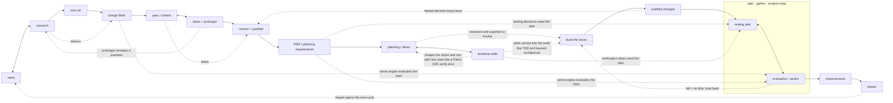

# Structured Workflow Scratchpad

Temporary planning notes. Delete this file after the README and final project
docs have absorbed the useful context.

Inquiry-Analysis, Developing-Ideas, and Creating-Solution are now written up as
self-contained phase docs: `skills/inquiry-analysis/README.md`,
`skills/developing-ideas/README.md`, and `skills/creating-solution/README.md`.
The cross-phase position file has a starter template at
`workflow-management/workflow-tracker.md`. This scratchpad keeps the source
research, the cross-phase artifact flow, the adversarial-review concept, and the
remaining open threads.

## Naming Decisions To Preserve

Structured Workflow should not expose source-system names as the active product
surface.

- Matt `grill-with-docs` maps to Structured Workflow `Interview`.
- Matt `CONTEXT.md` (glossary-only) maps to Structured Workflow `GLOSSARY.md`.
- Matt `CONTEXT-MAP.md` maps to `GLOSSARY-MAP.md`, only when multiple glossary
  contexts are needed.
- Matt's ubiquitous-language idea maps to resolving ambiguity between human,
  agent, artifacts, tests, code, and reviews.

## MYP Strand Structure (grounded in the design-cycle diagrams)

Verified against the Criterion A, B, and C diagrams on the Design and Inquiry
site (Aidan Hammond). Each criterion has four strands. In A and B **the first
three strands produce the fourth — and the fourth is the handoff artifact**
(symmetric). **Criterion C breaks that symmetry:** C1 and C2 interleave into the
plan, C3 builds it, and C4 justifies departures. **Criterion D returns to the
symmetric shape and sits across all of them:** D1 + D2 produce D3 -> D4 (impact,
the terminal summary), and the *same* evaluation engine can be pointed at the
Design Brief, the PRD, and the issues — not only the finished build.

```text
A1 need      \
A2 research   } -> A4 Design Brief   (summarizes A1-A3)
A3 prior art /

B1 spec/criteria \
B2 ideas+prototype } -> B4 PRD/export (the requirements for creating the chosen
B3 chosen+justified/                   solution; "planning drawings" reinterpreted
                                       per task: API contracts, schema, test seams)

C1 planning  <->  C2 technical skills  (choosing which skills/tools/methodology
       |                                to use IS part of planning; the choice
       | reviewed, exported to tracker  shapes the slices and can add new ones)
       v
C3 build the slices  ->  C4 justified changes  (departures from the plan, with
                                                confidence)

D1 testing plan <-> D2 evaluation/verdict  (plan, gather, analyze data; the same
       |                                     engine also judges the Design Brief
       | fail = no ship                      and the PRD; D1 is seeded by B4
       v                                     testing decisions + C2 verify slices)
D3 improvements  ->  D4 impact              (D4 is the terminal summary and opens
                                             the next cycle, looping back to A1)
```

The dotted arrows are the intrinsic back-and-forth (research feeds every strand;
specs and ideas interplay; a prototype can throw a question back to inquiry):


<!-- A = inquiry, B = developing-ideas, C = creating-solution,
     D = evaluating (a cross-phase engine; its fullest use is the post-build
     verdict). Dotted = back-and-forth / cross-strand influence. -->

Key reads from the diagrams (these justify the fluid, non-gated model):

- **The back-and-forth is drawn into the structure, not a caveat.** A2 (Research)
  arrows point both ways — back to A1 and forward through A3 to A4 ("Research
  informs the other steps of Criterion A"). B1 <-> B2 is bidirectional, with a
  curved arrow from B1 back into B3. Nothing is final until the whole criterion
  settles.
- **The prototype move is native to B2.** B2 is wrapped in an "Explore ideas /
  Test ideas / Gather feedback" box — that IS the prototype-to-answer move. It
  lives in developing-ideas but is reachable early, even mid-inquiry: you can
  start researching, realize you need a develop-ideas prototype to get feedback
  on a direction *before* the questions are answered and B1 specs can be written,
  then carry the answer back.
- **B1-B4 are the internal structure of one `developing-ideas` document.** B1
  turns the Design Brief into design specifications. B2 explores feasible ideas
  through sketching/prototyping/testing/feedback. B3 presents and justifies the
  chosen design against the specifications. B4 captures the planning
  drawings/diagrams and creation requirements. For software, B4 is the PRD/export
  surface that can be mirrored to Linear or another issue tracker for issue
  decomposition.
- **Criterion C: technical-skill selection IS planning, and it shapes the
  issues.** The source C diagram shows C1 <-> C2 as a two-way arrow, then
  C2 -> C3 -> C4. C1 (planning) and C2 (technical skills) go back and forth
  because deciding *which* skills, tools, and methodology to use is itself part of
  planning. Example: "I need the TDD skill, VGV's layered-architecture
  conventions, and Patrol's E2E docs to produce the visual-validation artifact the
  human and I need for a high confidence score." That selection then feeds back
  into the issues — it can add a slice (e.g. a final Patrol E2E run to fully verify
  the build). C1 + C2 are staged and adversarially reviewed in the
  creating-solution document, exported to the tracker, then C3 builds and C4
  records any justified departure. A flawed decision discovered mid-build loops
  back to developing-ideas (or inquiry).
- **Criterion D: symmetric in shape, but a cross-phase engine in use.** The source
  D diagram boxes D1 (Testing Plan) and D2 (Evaluation) together as "plan, gather,
  analyze data" with a two-way arrow, then D2 -> D3 (Improvements) -> D4 (Impact).
  So D1+D2 produce D3 -> D4, and D4 (impact on the client) is the terminal summary
  — symmetric with A4/B4. Two reinterpretations for software: (1) **the testing
  plan is not born in D** — it accrues from B4's Testing Decisions and the C2
  verification slices, so D1 consolidates and executes a plan that has been forming
  since developing-ideas; (2) **the same evaluation engine is reusable across the
  cycle** — pointed at the Design Brief, the PRD, or the issues, not only the
  finished build. D2's verdict against the original criteria + the project
  Definition of Done is the one hard gate (fail = no ship); D3/D4 can open the next
  cycle, looping back to A1.

## Source Ingredients (from the real skills)

Each favorite contributes one distinct ingredient. They are parts of one phase,
not alternatives.

### grill-with-docs / grill-me (Matt Pocock) — the engine

Source: `~/.agents/skills/grill-with-docs/SKILL.md`, `.../grill-me/SKILL.md`.

- Interview relentlessly; walk the design tree one branch at a time, resolving
  dependent decisions in order; give a recommended answer per question.
- Ask one question at a time; if the codebase can answer it, explore instead.
- Challenge the user's wording against the glossary; sharpen fuzzy/overloaded
  terms; stress-test with concrete scenarios; cross-reference against code.
- Update `GLOSSARY.md` inline as terms resolve (glossary-only, no implementation
  detail). Offer ADRs sparingly: only hard-to-reverse + surprising + real
  trade-off.
- `grill-me` is the no-docs fallback when there is no domain surface yet.

### Superpowers brainstorming — the hard gate

Source: `github.com/obra/superpowers` `skills/brainstorming/SKILL.md`.

- Ordered checklist: explore context -> (offer visual companion) -> clarifying
  questions one at a time -> propose 2-3 approaches -> present design in
  sections with approval after each -> write design doc -> spec self-review ->
  user reviews spec -> transition to planning.
- HARD GATE: do not code/scaffold/invoke implementation until a design is
  presented and approved. Applies to every project, "too simple" included.
- Spec self-review scans for placeholders, contradictions, scope, ambiguity.
- It bundles a lot into one skill: not just inquiry and the 2-3-approaches
  idea-generation, but the full technical design/spec — architecture,
  components, data flow, error handling, testing. In our four buckets that one
  source skill spans all of `inquiry-analysis` AND `developing-ideas`.
- Scope-decomposition: if the request is several independent subsystems, it
  stops and decomposes into sub-projects first, each getting its own
  spec -> plan -> implementation cycle. (Converges with VGV's Step 0 "is this
  even one project?" check.)

### VGV Wingspan brainstorm — phase discipline + the clarity gate

Source: `github.com/VeryGoodOpenSource/vgv-wingspan` `skills/brainstorm/SKILL.md`.

- Clarify WHAT before HOW. Step 0 assesses scope (new project vs feature).
- Up-front CLARITY GATE (0.1): if requirements are already clear, skip
  brainstorm and suggest going straight to planning. Brainstorm only when there
  is real ambiguity.
- Lightweight project research first; collaborative Q&A one at a time
  (multiple-choice preferred, broad -> narrow, success criteria early).
- 2-3 concrete approaches with trade-offs, lead with a recommendation; YAGNI
  ruthlessly, prefer boring/existing patterns, right-size architecture.
- Capture a dated brainstorm doc, then an explicit handoff that can **clear
  context** before planning. DO NOT CODE.

### ACT spec-writing / refine-spec — output shape + adversarial review

Source: `~/.agentic-coding-toolkit/skills/act-workflow-spec`, `.../refine-spec`.

- Spec dimensions: goal, scope, user flows (with a permutation checklist:
  first-time vs returning, offline/slow, partial/resume, cancel/rollback,
  concurrency), constraints, edge cases, validation, codebase context.
- Preview-outline gate before writing the full spec.
- `refine-spec` is an adversarial reviewer: review-only first, no silent edits,
  five dimensions (completeness, assumptions, UX coherence, data model, codebase
  alignment), findings by severity, then a review gate.

## Developing-Ideas Research Evidence (2026-06-05)

Purpose of this pass: identify which source skills especially belong to
`inquiry-analysis` and `developing-ideas`, with concrete evidence. This is source
research only; final product docs should still use our names, not source-system
names.

Sources checked:

- Local Matt skills: `grill-with-docs`, `grill-me`, `ubiquitous-language`,
  `to-prd`, `prototype`, `to-issues`.
- Local ACT skills: `act-workflow-spec`, `act-workflow-refine-spec`,
  `act-workflow-plan`, `act-workflow-work`.
- Live VGV Wingspan: README plus `brainstorm`, `plan`, `refine-approach`,
  `plan-technical-review`.
- Live Superpowers: `brainstorming`, `writing-plans`, and skill inventory.
- Live VGV AI Flutter Plugin: README and skill inventory.
- Live Cursor Team Kit: README, skill/agent inventory, `verify-this`,
  `control-cli`, `control-ui`, `workflow-from-chats`,
  `thermo-nuclear-code-quality-review`.
- Local Codex Product Design plugin:
  `/Users/jholt/.codex/plugins/cache/openai-curated-remote/product-design/0.1.42`
  README plus `user-context`, `get-context`, `research`, `ideate`,
  `prototype`, `audit`, `design-qa`, and `critical-overrides`.

### Product Design ideas to preserve

The Codex Product Design plugin contributes several concrete workflow ideas that
fit our first two buckets without requiring us to copy its product surface.

- **Saved context as curated source memory.** `user-context` stores recurring
  product/design references: product URLs, Figma files, screenshots, reference
  images, codebase paths, Storybook, tokens, design systems, brand assets,
  component refs, browser preferences, and share targets. It explicitly says to
  inspect only what the current task needs and to prefer a few high-value
  references over a dump.
- **Design brief confirmation before design/build.** `get-context` asks only for
  missing product, visual-source, and interactivity details; if already known,
  it plays back the brief instead of re-asking. Hard boundary: no UI
  implementation, scaffolding, server, or files while context is missing.
- **Source-grounded UX research.** `research` restates product, audience, time
  horizon, and scope; searches public/internal sources; separates observed
  evidence from inference; clusters problems; ranks by severity, frequency,
  confidence, and product leverage; outputs source map and opportunity map.
- **Exactly three design directions before a visual build.** `ideate` runs only
  after the brief is confirmed; resolves references; inspects actual visual
  sources; generates three independent options with distinct hierarchy, layout,
  interaction model, or product framing; then stops for user selection.
- **No visual target, no build.** `prototype` treats a brief as insufficient for
  building. If there is no URL, screenshot, Figma frame, mockup, source image, or
  existing code target, the flow is: confirm brief -> ideate -> user chooses a
  visual target -> build.
- **Evidence-first product review.** `audit` captures screenshots of a flow
  before critique, ties findings to steps/screenshots, and reports evidence
  limits. `design-qa` compares a source visual target against the rendered
  implementation before handoff; if either artifact is missing, the result is
  blocked.

Implication for us: Product Design strengthens the distinction between a
**Design Brief** and a **selected direction**. A brief can authorize ideation; it
does not authorize implementation. A selected approach, prototype answer, or
visual target becomes evidence inside the developing-ideas document, especially
B2/B3/B4.

### Bucket placement from evidence

**Strong `inquiry-analysis` sources**

- Matt `grill-with-docs` / `grill-me`: primary Interview engine. Evidence:
  one question at a time, recommended answer per question, explore codebase
  before asking, challenge glossary conflicts, update glossary inline.
- Matt `ubiquitous-language`: glossary function. Evidence: resolves ambiguous
  or overloaded terms into canonical shared language. Product mapping:
  `GLOSSARY.md`, not `CONTEXT.md`.
- VGV `brainstorm` Step 0 and 1. Evidence: classify new project vs feature,
  assess whether requirements are already clear, run lightweight project
  research, then ask broad-to-narrow questions about purpose, users,
  constraints, success, edge cases, existing patterns.
- Superpowers `brainstorming` early checklist. Evidence: explore project
  context, ask clarifying questions one at a time, understand
  purpose/constraints/success criteria before implementation.
- ACT `act-workflow-spec` early workflow. Evidence: gather context from files,
  examples, and patterns before asking; extract goal/scope/constraints/gaps;
  map user journeys, decision points, states, and entry/exit paths.
- Product Design `user-context`: source-memory pattern. Evidence: saved
  references ground future work but are curated and inspected only as needed.
  This supports our "files are context" philosophy without endorsing source
  sprawl.
- Product Design `get-context`: brief confirmation pattern. Evidence: ask only
  for missing product, visual, and interactivity details; otherwise play the
  brief back. This is close to Inquiry's Design Brief endpoint, with a strong
  reminder that playback can replace another interview round.
- Product Design `research`: evidence-gathering pattern. Evidence: source map,
  observed-vs-inferred separation, severity/frequency/confidence ranking, and
  opportunity map. This belongs in Inquiry when the task is understanding user
  pain, product friction, onboarding, docs/help, support, or workflow problems.

**Strong `developing-ideas` sources**

- Matt `to-prd`: PRD synthesis. Evidence: explicitly says do not interview the
  user; synthesize from existing conversation and codebase understanding. PRD
  sections: Problem Statement, Solution, User Stories, Implementation Decisions,
  Testing Decisions, Out of Scope, Further Notes. Also requires testing seams
  before writing.
- ACT `act-workflow-spec`: high-resolution requirements artifact. Evidence:
  full spec sections cover goal, background, user flows, requirements,
  boundaries, implementation, validation, done_when. This maps well to B1
  criteria and B4 PRD content, but our PRD should stay interview-free when the
  Design Brief already exists.
- VGV `brainstorm` Step 1.3: approach generation and choice. Evidence: propose
  2-3 concrete approaches with trade-offs, lead with a recommendation, prefer
  boring existing patterns, right-size architecture, ask which approach the user
  prefers. This maps directly to B2 ideas -> B3 chosen/justified.
- Superpowers `brainstorming` middle/late checklist. Evidence: propose 2-3
  approaches, present design sections with approval, then write a design doc and
  review it before planning. This source spans both current buckets; its
  "approaches/design/spec" material belongs to developing-ideas.
- Matt `prototype`: prototype-to-answer. Evidence: prototype is throwaway code
  that answers one question; choose logic/state vs UI branch; no persistence by
  default; delete or absorb when done; keep only the answer in a durable place.
  This is the cleanest source for the B2 "Explore / Test / Gather feedback"
  move.
- Cursor Team Kit `control-cli`, `control-ui`, and `verify-this`: evidence
  harness support, not standalone phase skills. Evidence: drive local CLI/UI
  surfaces, capture screenshots/transcripts/profiles, and return a falsifiable
  verdict. These support prototype-to-answer and later evaluation.
- VGV `refine-approach`: PRD/brief refinement pattern. Evidence: assess what is
  unclear, unnecessary, unstated, risky, or under-estimated; score Clarity,
  Completeness, Specificity, YAGNI, Scope; highlight one must-address issue;
  ask before substantive changes; recommend completion after about two passes.
- ACT `act-workflow-refine-spec`: adversarial PRD review. Evidence: review-only
  first, no silent edits, stop at review gate; judge completeness, assumptions,
  UX coherence, data model, codebase alignment; present findings by severity and
  recommended changes.
- VGV `plan-technical-review`: parallel reviewer pattern. Evidence: dispatches
  code-simplicity, VGV-practices, and plan-splitting reviewers in parallel; can
  split oversized work into standalone plans. This is a useful pattern for PRD
  review, even though the source object is an implementation plan.
- Product Design `ideate`: visual/product direction generation. Evidence:
  requires a confirmed brief first, resolves/inspects relevant references, then
  generates exactly three independent options and stops for user selection. This
  maps directly to B2 ideas and B3 chosen/justified, especially for UI/product
  work.
- Product Design `prototype`: no-visual-target/no-build discipline. Evidence:
  a confirmed brief is not a visual target; new products or redesigns without a
  source must go through ideation and selection before build. This sharpens our
  developing-ideas boundary: B4/PRD content can include the selected direction,
  but build should not start from brief alone.
- Product Design `audit`: product-flow evidence review. Evidence: capture
  current flow screenshots, inspect each step, tie UX/design/accessibility
  findings to concrete screenshots, and state what screenshots cannot prove.
  This can be Inquiry when auditing the current system to understand the problem,
  or Evaluating when reviewing a built solution.

**Boundary or later-phase sources**

- Matt `to-issues`: not developing-ideas. It starts `creating-solution` by
  turning a plan/spec/PRD into vertical tracer-bullet issues, each HITL or AFK,
  with user approval of granularity and dependencies before publishing.
- ACT `act-workflow-plan`: mostly `creating-solution`. Evidence: reads a spec,
  researches codebase patterns, maps requirements to files, creates a concise
  implementation plan, and starts with a thin end-to-end vertical slice. It
  informs the PRD-to-implementation boundary but should not define the PRD.
- ACT `act-workflow-work`: `creating-solution`. Evidence: executes plan phases,
  reconciles checklist truth, validates, commits, and ships.
- Superpowers `writing-plans`: `creating-solution`. Evidence: assumes a spec or
  requirements already exist and writes bite-sized implementation steps with
  exact files, tests, commands, and commits.
- VGV `plan`: boundary between developing-ideas and creating-solution. Evidence:
  it consumes a recent brainstorm, extracts key decisions, performs targeted
  codebase research, checks whether external research is needed, runs user-flow
  analysis, writes `docs/plan/...`, and offers build/review/refine options. Our
  PRD can borrow research consolidation and acceptance-criteria pressure from
  this, but the implementation plan itself belongs later.
- VGV AI Flutter Plugin skills: mostly standards and criteria, not phase flow.
  Evidence: README describes contextual best-practice skills for Flutter/Dart
  architecture, naming, folders, testing, anti-patterns, and hooks. Skills such
  as `accessibility`, `testing`, `layered-architecture`, `navigation`,
  `material-theming`, `bloc`, `static-security`, and `ui-package` may inform PRD
  constraints or review criteria when relevant, but they are not core
  inquiry/developing workflow skills.
- Cursor Team Kit CI/review/shipping skills: later-phase. Evidence: skills like
  `loop-on-ci`, `review-and-ship`, `fix-ci`, `run-smoke-tests`,
  `make-pr-easy-to-review`, and `thermo-nuclear-code-quality-review` are
  implementation/evaluation/release workflows, not current-bucket candidates.
- Cursor `workflow-from-chats`: meta-inquiry for agent preferences. Evidence:
  extracts durable workflow preferences from recent chats into skills, rules, or
  workflow docs. Useful for our own repo-building process, but not a normal
  feature-work phase skill.
- Product Design `image-to-code` and `url-to-code`: `creating-solution`. They
  implement a selected visual target or source URL as a prototype; they should
  not define Inquiry or Developing-Ideas.
- Product Design `design-qa`: `evaluating`. Evidence: requires both source
  visual truth and rendered implementation, compares them, produces prioritized
  findings, and marks the result `passed` or `blocked`.
- Product Design `share`: post-build handoff/publishing, outside current
  buckets.

## Creating-Solution (Criterion C) decisions (2026-06-05)

Written up in `skills/creating-solution/README.md`. Criterion C **breaks the A/B
symmetry**: its real product is working code + tests, not a fourth-strand handoff
doc. The strands:

- **C1 Planning** — decompose the PRD into tracer-bullet vertical slices.
- **C2 Technical Skills** — selected *during* slicing: which engineering
  conventions apply (e.g. VGV Flutter/Dart, Vercel TS/React), which tools the work
  needs (e.g. Patrol for E2E), and the methodology to carry the plan forward
  (e.g. TDD). Attached to the slices. We reference conventions here; the standing
  engineering criteria live in the per-project Definition-of-Done template, applied
  by the evaluation system (see "Two levels of criteria" below — no `ENGINEERING.md`).
- **C3 Creating the solution** — follow the published slices: mark in-progress ->
  build -> verify it builds and works at the slice level -> commit -> mark
  complete. Deep review/acceptance is deferred to evaluating.
- **C4 Justifying changes** — the agent's account of departures from the
  PRD/Design Brief: what changed, why (the wall/barrier + evidence), how, and a
  confidence signal. Written only when implementation forces a deviation.

**Key structural decision (user, 2026-06-05): phase C keeps the one-durable-doc
symmetry after all.** To adversarially review the slice breakdown *before* it
becomes trackable work, the breakdown must exist as a local draft. So there is a
**creating-solution document** that stages C1 (Slices) + C2 (Technical Approach),
is adversarially reviewed locally while cheap to change, then **exported to the
tracker** (Matt `to-issues`) as HITL/AFK-labeled issues — exactly how the PRD
exports. **C4 (Justified Changes) folds into that same document** instead of being
a separate file. The live tracker issues are what C3 executes against.

Locked answers from the user this session:

- C1 turns the PRD into issues on the tracker (Matt Pocock style); the tracker is
  the live plan, the doc is the local staging/refinement surface.
- Verification boundary: **C owns slice-level "it builds and works"; deep review
  is in evaluating.**
- C2 technical skills = select conventions/tools/methodology now; defer named
  principles to evaluating.
- Adversarial review happens **before issues are published** (on the draft slices
  in the doc). Criteria: coverage, verticality, granularity, sequencing,
  HITL/AFK labels, technical approach.
- Only one local markdown artifact in phase C: the creating-solution document
  (justified-changes folded in). No separate implementation-evidence note.

Engine: **follow the plan, building in verifiable vertical slices** — decompose ->
review locally -> publish -> build a slice end-to-end -> verify -> commit ->
justify any deviation.

## Evaluating (Criterion D) analysis (2026-06-05)

Analysis only — not yet written up as `skills/evaluating/README.md`. Grounded in
real sources read this session: ACT `act-meta-audit-work`,
`act-workflow-refine-spec`, `act-workflow-work`; Codex Product Design `design-qa`;
VGV `plan-technical-review`. (Earlier evaluating-source notes are in
"Developing-Ideas Research Evidence" above.)

### MYP Criterion D -> software

Source order: D1 design a testing method -> D2 evaluate the solution against the
design specification -> D3 explain how the solution could be improved -> D4
explain the impact on the client/target audience. Reinterpreted per software task:

- **D1 — Design the testing methods.** Decide *how* the solution will be proven:
  the test/verification methods and the evidence each will produce (unit/widget,
  integration, E2E, smoke, manual checks, screenshots/transcripts/profiles). The
  methods are chosen to test against the *original success criteria* from the
  Design Brief and the PRD — not invented to flatter the build.
- **D2 — Test and evaluate against the specifications.** Run the methods, capture
  evidence, and judge the built solution against the original criteria. This is
  the **deep acceptance** that creating-solution deliberately deferred (C only
  owned slice-level "it builds and works"). Output is a falsifiable verdict, not
  a vibe.
- **D3 — Improvements.** From the gaps D2 exposes, state concretely how the
  solution could be improved — follow-up work, known limitations, deferred scope.
- **D4 — Impact.** State the solution's impact on the client/audience: does it
  solve the need the Design Brief justified, and what changed for the user.

### The user's framing: the testing plan is built across all phases

Key point the user made entering this phase: **D1 is not born in phase D.** The
testing plan accretes from the start —

- the PRD (B4) already carries **Testing Decisions** and the **test seams**;
- creating-solution's C2 technical approach already **adds verification slices**
  (e.g. a final Patrol E2E slice producing the visual-validation artifact needed
  for a high confidence signal).

So evaluating *consolidates and executes* a testing plan that has been forming
since developing-ideas, rather than designing it cold. This fits the spine we
already have: thinking about "how will I prove this?" is a first-class concern in
every phase, and `evaluating` is where it pays out. Worth saying explicitly in
the README (and possibly back-referencing from the PRD / creating-solution docs).

### Reframe (user, 2026-06-05): evaluation is a cross-phase engine, not just terminal D

The decisive shift: **evaluation is not only the last phase.** It is a flexible
evaluation system the agent can **jump to from any phase** to evaluate the current
state against its criteria:

- the **Design Brief** (from inquiry-analysis),
- the **PRD** (from developing-ideas),
- the **issues / slice breakdown** (from creating-solution planning), and
- the **post-completion work** (the built solution).

This means the per-phase "Evaluating the X: adversarial review" sections we
already wrote into the other three phase docs are **invocations of this one
system** — evaluation generalized, not three separate review rituals. MYP
Criterion D (test the built solution) is the **fullest / terminal application** of
the same engine, not a different mechanism.

Consequences:

- **Evaluation is the most critical piece of the framework.** Everything else
  produces artifacts; evaluation is what makes any of them trustworthy. The README
  should frame it as a reusable capability, then show D1-D4 as its richest use.
- **One evaluation document that keeps getting added to.** It is not written once
  at the end — it **accumulates** an entry each time evaluation is invoked,
  recording **what we tested and why** at each state. It is the running record of
  the workflow's own scrutiny.
- **Do not import other skills' structures.** We are not adopting other systems'
  shapes into our framework. We add capability later, only when we can clearly see
  how it adds value. In particular, the C2 "technical skills" become a **bundle of
  skills the agent can additionally call** — deferred to a later phase, not baked
  in now.

### Durable shape: one accumulating evaluation document

One durable file — the **evaluation document** — appended to on each invocation.
Each entry records a single evaluation event:

```text
# Evaluation Log: <project>

## Evaluation — <state> (<date>)        e.g. "Design Brief", "PRD", "issues", "built solution"
   - Criteria          — what this state is judged against (its source-of-truth)
   - Testing methods    — how it was tested/checked, and why those methods (D1)
   - Evidence & verdict — findings + per-criterion verdict, honest about confidence (D2)
   - Improvements       — gaps and follow-up (D3)   [richest at the build stage]
   - Impact             — effect on the justified need / client (D4)  [build stage]
```

Earlier-state entries (Design Brief, PRD, issues) lean on Criteria + Methods +
Evidence/verdict; the **built-solution** entry is the full D1-D4 application
(testing methods -> results -> improvements -> impact). The document is the single
place that shows, end to end, **what was tested, why, and what the verdict was**
at every state the workflow passed through.

Note on MYP symmetry: A and B are "first three strands produce the fourth handoff
artifact"; C breaks it (product is code); **D is the engine that judges all of
them.** The clean symmetric A4/B4-style reading still holds *within* the
built-solution entry (D1+D2 feed D3+D4), but the phase as a whole is better
described as the cross-phase evaluator than as a fourth parallel criterion doc.

### The verdict model (the strongest borrowed pattern)

ACT `act-meta-audit-work` gives a clean, honest verdict vocabulary for D2 that
also dovetails with our **confidence signaling** principle:

- per-check status: **Verified / Likely / Not Provable / Failed / Skipped**
  (never use "Failed" for missing evidence alone);
- overall verdict: **Pass / Pass-With-Warnings / Fail**;
- **evidence-based, honest about confidence** — do not present likely inferences
  as verified facts.

Codex `design-qa` gives the **source-of-truth comparison** discipline for D2:

- you need **both** artifacts present — the source-of-truth (here: the original
  criteria from the Design Brief + PRD) **and** the rendered/built result. If
  either is missing, the result is **blocked**, not "passed."
- don't judge from memory/code alone — open/run both and compare what is actually
  there;
- findings by severity (P0-P3) tied to concrete evidence; final result is exactly
  `passed` or `blocked`.

Synthesis: D2's verdict is a per-criterion table (each original success criterion
-> Verified/Likely/Not Provable/Failed, with cited evidence), rolled into an
overall Pass / Pass-With-Warnings / Fail. Missing evidence => blocked, not passed.

### Adversarial review in evaluating

Two distinct things, keep them straight:

1. Evaluating is *itself* an adversarial check of the solution (that is the whole
   phase). 
2. The **evaluation document** is still a steering artifact (it says "ship" or
   "loop back"), so it gets the same cross-phase adversarial-review pass as the
   Design Brief / PRD / slice breakdown — review-first, findings by severity, one
   must-address, a real gate, ~2 passes. Prevents a flattering self-evaluation
   from rubber-stamping a broken build.

### Open thread #5 (named criteria set / ENGINEERING.md) — KILLED (user, 2026-06-05)

**Decision: no `ENGINEERING.md`.** It never existed (no file in the repo — it was
only a *proposed* artifact in HANDOFF/SCRATCHPAD) and it is **not** ADRs (those are
the separate sparse decision-record concept). It was a holdover borrowed from VGV's
`@vgv-review-agent` "Very Good Engineering" named-criteria idea. We do not add a doc
for its own sake.

Where the criteria live instead: **inside the evaluation system itself** — the
lenses it applies depend on which state it is pointed at:

- evaluating a **Design Brief / PRD / issues** -> document-quality criteria
  (clarity, completeness, specificity, scope/YAGNI, alignment, language) — the same
  criteria already written into the per-phase review sections;
- evaluating the **built solution** -> add the engineering lenses (simplicity,
  convention alignment, right-sizing, verifiability, traceability to PRD/Brief).

These are described in the evaluating README as part of the engine, not extracted
into a standalone principles file. (VGV `plan-technical-review` stays useful as a
*pattern* — named reviewers in parallel, each one lens — without us copying its
file shape; per the "no importing other skills' structures" decision.)

### Two levels of criteria + per-project templates (user, 2026-06-05)

This is where the "general criteria" the evaluator uses actually live — replacing
the killed `ENGINEERING.md` cleanly, and it is **user-owned, not framework-imposed**.
The ship gate checks criteria at **two levels**, and we capture **both**:

- **General Definition of Done (project level).** Stable criteria that apply to
  *every* design cycle in a project — e.g. "generated code is regenerated/updated",
  "formatting is complete", "lint/analyze clean", "tests pass". The user sets these
  once.
- **Specific criteria (PRD / issue level).** The cycle's own success criteria,
  inherited from the Design Brief's justified need and the PRD, decomposed to the
  issue level. These change every cycle.

A Fail at *either* level blocks ship.

**Customizable per-project templates.** The framework ships starter templates; the
user customizes them into **personal project templates** that every new design
cycle is built from. The project-level Definition of Done lives in that template,
so each new cycle automatically starts carrying the user's standing criteria
("generated code updated, formatting done, …") without re-stating them. The
cycle-specific criteria are added on top from the Brief/PRD/issues.

Implications to reflect when drafting:

- The evaluation document's "Criteria" for the built-solution / ship entry is the
  **union of the project DoD (from the template) and the PRD/issue-level criteria**.
- This generalizes the template idea: artifacts are seeded from per-project
  templates the user owns and customizes (the DoD is the first concrete instance).
  Likely a `workflow-management/` template surface; exact mechanics TBD, but the
  DoD-in-template decision is firm.
- It also tightens "what we tested and why": the evaluation log shows each criterion
  (DoD or specific), how it was tested, and its verdict.

### What "gate" means (two senses — needed to settle the gate question)

The word has been doing two jobs:

- **Hard gate (enforcement):** the workflow *mechanically refuses* to move on
  until a condition passes; the agent cannot proceed. (Superpowers won't write code
  until a design is approved, even for trivial work.)
- **Soft gate (orientation):** the agent knows the target artifact and *offers* to
  produce it / surfaces blockers, but never refuses; control flows and loops back.
  This is what inquiry / developing / creating currently use.

Eval emits a **verdict** — Pass / Pass-with-warnings / Fail. The gate question is
whether a Fail **blocks** downstream or merely **informs** it. With the cross-phase
reframe, eval is not a checkpoint bolted to a boundary — it is a **lens pointed at
the current state on demand**. So it is "a gate" only in that its **verdict is
authoritative**: a Fail means "this state is not trustworthy to build/ship on."
Whether that hard-stops:

**RESOLVED (user, 2026-06-05): ship is the single hard stop.** We **cannot ship
when any stated criterion is failing** — that is a real, mechanical refusal, the
one hard gate in the framework. Everywhere else eval stays **soft/advisory**:
pointed at a Design Brief / PRD / issues, it surfaces the Fail + the one
must-address item and the human decides whether to proceed or loop back. The
ship gate is the exception because the stated criteria are the contract.

### Endpoint, handoff, and loop-back

- Endpoint is **orientation**, like the other phases: the agent knows it is heading
  to a verdict and offers it when the evidence is in.
- As the **last** core phase, evaluating's "handoff" is twofold: (a) the **verdict
  + ship** to the human/client (D4 impact), and (b) **loop-back** — D3 improvements
  and any Failed criteria can seed a new Inquiry cycle (recorded in
  `workflow-tracker.md`). The cycle closes or restarts; it does not dead-end.

### Resolved by the user (2026-06-05)

- **One accumulating evaluation document** — confirmed (not a thinner artifact).
- **Evaluation is a cross-phase engine** jumpable from every phase; evaluates the
  Design Brief, PRD, issues, and built solution; it is the most critical piece and
  keeps getting added to; it shows what we tested and why.
- **No importing other skills' structures.** Add capability later when value is
  clear; "technical skills" become a callable bundle, deferred — not baked in now.

### Status before drafting

Resolved:

- **One accumulating evaluation document**; evaluation is a **cross-phase engine**
  jumpable from every phase.
- **`ENGINEERING.md` — KILLED.** Criteria live inside the evaluation system; the
  *general* criteria live in the per-project Definition-of-Done template (above).
- **Gate — ship is the single hard stop:** cannot ship while any stated criterion
  (project DoD *or* PRD/issue level) is failing; everywhere else eval is advisory.
- **Two criteria levels + per-project templates** carry the standing DoD into every
  cycle.

Remaining (does not block drafting):

- Consistency follow-up: the three existing phase docs describe adversarial review
  inline. Once evaluating is the named engine, add a light pointer that those are
  invocations of evaluating (leaning: pointer, no rewrite).
- Template mechanics (where the per-project templates live / how a cycle is seeded)
  — sketch only; the DoD-in-template decision itself is firm.

## Adversarial Review (cross-phase concept)

Every steering artifact is untrusted until an adversarial review pass clears it.
This is a cross-phase pattern: the Design Brief (inquiry-analysis), the B4/PRD
section inside the developing-ideas document, and the implementation plan / code
(creating-solution, evaluating) all face the same discipline. First instance is
written up in `skills/inquiry-analysis/README.md`.

The shared shape (grounded in the real sources):

- **Spawn focused reviewers in parallel**, each with one lens, judging the
  artifact against an explicit criteria set. *(VGV `plan-technical-review` runs
  `@code-simplicity-review-agent`, `@vgv-review-agent`, `@plan-splitting-agent`
  in parallel.)*
- **Criteria are explicit and named.** VGV `refine-approach`: Clarity,
  Completeness, Specificity, YAGNI, Scope. VGV `@vgv-review-agent`: Very Good
  Engineering practices. ACT `refine-spec`: completeness, assumptions, UX
  coherence, data model, codebase alignment.
- **Review first, no silent edits.** The pass produces findings; it does not
  quietly rewrite the artifact.
- **Findings by severity**, with one prominent **must-address** item.
- **A gate, not a rubber stamp.** Blocking findings route back; the artifact is
  not downstream authority until it passes.
- **Bounded iteration** — ~2 passes, then complete or escalate.

Our criteria set — RESOLVED (2026-06-05): **no `ENGINEERING.md`** (see "Open thread
#5 ... KILLED" below). The criteria each reviewer judges against live inside the
**evaluation system**, which is a cross-phase engine the agent points at the
current state (Design Brief / PRD / issues / built solution). For documents the
lenses are document-quality (clarity, completeness, specificity, scope, alignment,
language); for the built solution they add the **two-level criteria** — the
per-project **Definition of Done** (from the customizable project template) plus
the **PRD/issue-level** success criteria. **Ship is the one hard gate:** it
refuses while any stated criterion fails. Elsewhere the review is advisory.

## Phase Artifact Flow (verified)

Each phase owns one durable phase document. That document is what the next phase
reads. The documents ARE the cross-phase memory — not a separate handoff step.

```text
inquiry-analysis   -> inquiry document (full findings step by step; its final
                                       Design Brief section is the handoff)
developing-ideas   -> developing-ideas document
                                      (B1 specifications, B2 ideas/feedback,
                                       B3 chosen design, B4 PRD/export content)
creating-solution  -> creating-solution document + code + tests
                                      (C1 slices + C2 technical approach staged in
                                       the doc, reviewed, exported to the tracker;
                                       C3 builds; C4 justified changes fold into
                                       the doc; code + tests are the real product)
evaluating         -> review/evidence
```

Verified against the real skills:

- **B4/PRD synthesis is interview-free.** Matt `to-prd`: "Do NOT interview the
  user — just synthesize what you already know." The interviewing happened in
  inquiry-analysis and the decisions happened across B1-B3, so B4 synthesizes
  rather than re-asks. PRD-shaped content: Problem / Solution / User Stories /
  Implementation Decisions / Testing Decisions / Out of Scope / Notes.
- **Creating-solution starts by decomposing B4/PRD content.** Matt `to-issues`
  breaks "a plan, spec, or PRD" into tracer-bullet vertical slices: each cuts
  through all layers, is demoable on its own, and is marked HITL or AFK.

Nuances to respect:

- "Interview-free" is precise about B4/PRD *synthesis*. Developing-ideas still
  includes exploration, testing, feedback, and explicit selection/justification.
  Those are design decisions, not a requirements interview reset.
- Design Brief vs developing-ideas overlap — **resolved via the MYP spine.**
  They are not competitors and do not duplicate: Design Brief = MYP A4, the
  *summary of the problem* (justified need + research + prior-art constraints) —
  the what/why, output of inquiry. Developing-Ideas = MYP B1-B4, the internal
  work of turning the brief into specifications, feasible ideas, a chosen
  design, and creation requirements. The PRD is the B4/export shape, not the
  whole phase document.

Durable files vs handoff:

- The phase documents plus the always-on `GLOSSARY.md` and `workflow-tracker.md`
  are the durable memory. The `handoff` skill is lightweight glue for clearing
  context mid-phase, not the primary continuity mechanism.
- This only works if files are written at the right moment, re-read at phase
  entry, kept bounded, and never duplicated.

## Open Threads (follow later, do not chase now)

1. **Inquiry <-> Developing-Ideas oscillation — model decided, mechanics TBD.**
   The MYP diagrams show the back-and-forth is intrinsic (see "MYP Strand
   Structure" above): B2's "Explore / Test / Gather feedback" box is the
   prototype-to-answer move, reachable mid-inquiry. The model: no hard wall;
   `workflow-tracker.md` records position and loop-backs; the agent orients
   toward the target artifact and offers to synthesize when blocking questions
   are gone. Still to write up: the concrete prototype jump-and-return mechanics
   (throwaway code answers one question, answer captured durably, prototype
   deleted).

2. **Gate inventory — leaning soft.** Gates found: clarity gate (entry to
   inquiry, skip when already clear — VGV); endpoint gate (exit of inquiry);
   approval gate (choosing an approach in developing-ideas — Superpowers/VGV);
   slice-approval gate (entry to creating-solution — `to-issues`). Superpowers
   enforces an absolute pre-implementation gate even for "simple" work. **Current
   direction: no hard gate** — orientation toward the target artifact instead, now
   baked into all three written phase docs. The agent offers; it does not block.
   Still to decide: whether ANY gate stays mandatory (likely the
   pre-implementation one at the creating-solution boundary).
