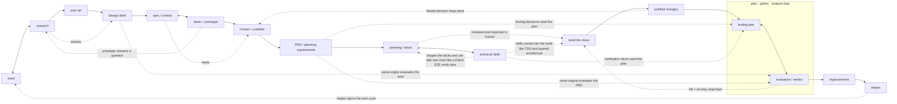

# Structured Workflow Scratchpad

Temporary planning notes. Delete this file once the source provenance below has
migrated to `NOTICE.md` and the remaining open threads are resolved.

**All four core phase docs are written:** `skills/inquiry-analysis/README.md`,
`skills/developing-ideas/README.md`, `skills/creating-solution/README.md`, and
`skills/evaluating/README.md`. The cross-phase position file has a starter template
at `skills/workflow-management/workflow-tracker.md`.

What this scratchpad still holds (everything else has been absorbed into the phase
docs and core README and removed): the **source-ingredient research / provenance**
(destined for `NOTICE.md`, which does not exist yet), the **MYP strand diagram**
(not duplicated in any product doc), the **naming map**, and the **open threads**.
The Criterion C/D decision notes, the Phase Artifact Flow, and the cross-phase
Adversarial Review writeup were baked into the phase docs and have been trimmed.

## Naming Decisions To Preserve

Structured Workflow should not expose source-system names as the active product
surface.

- Matt `grill-with-docs` maps to Structured Workflow `Interview`.
- Matt `CONTEXT.md` (glossary-only) maps to Structured Workflow `GLOSSARY.md`.
- Matt `CONTEXT-MAP.md` maps to `GLOSSARY-MAP.md`, only when multiple glossary
  contexts are needed.
- Matt's ubiquitous-language idea maps to resolving ambiguity between human,
  agent, artifacts, tests, code, and reviews.

## MYP Strand Structure (grounded in the design-cycle diagrams)

Verified against the Criterion A, B, and C diagrams on the Design and Inquiry
site (Aidan Hammond). Each criterion has four strands. In A and B **the first
three strands produce the fourth — and the fourth is the handoff artifact**
(symmetric). **Criterion C breaks that symmetry:** C1 and C2 interleave into the
plan, C3 builds it, and C4 justifies departures. **Criterion D returns to the
symmetric shape and sits across all of them:** D1 + D2 produce D3 -> D4 (impact,
the terminal summary), and the *same* evaluation engine can be pointed at the
Design Brief, the PRD, and the issues — not only the finished build.

```text
A1 need      \
A2 research   } -> A4 Design Brief   (summarizes A1-A3)
A3 prior art /

B1 spec/criteria \
B2 ideas+prototype } -> B4 PRD/export (the requirements for creating the chosen
B3 chosen+justified/                   solution; "planning drawings" reinterpreted
                                       per task: API contracts, schema, test seams)

C1 planning  <->  C2 technical skills  (choosing which skills/tools/methodology
       |                                to use IS part of planning; the choice
       | reviewed, exported to tracker  shapes the slices and can add new ones)
       v
C3 build the slices  ->  C4 justified changes  (departures from the plan, with
                                                confidence)

D1 testing plan <-> D2 evaluation/verdict  (plan, gather, analyze data; the same
       |                                     engine also judges the Design Brief
       | fail = no ship                      and the PRD; D1 is seeded by B4
       v                                     testing decisions + C2 verify slices)
D3 improvements  ->  D4 impact              (D4 is the terminal summary and opens
                                             the next cycle, looping back to A1)
```

The dotted arrows are the intrinsic back-and-forth (research feeds every strand;
specs and ideas interplay; a prototype can throw a question back to inquiry):


<!-- A = inquiry, B = developing-ideas, C = creating-solution,
     D = evaluating (a cross-phase engine; its fullest use is the post-build
     verdict). Dotted = back-and-forth / cross-strand influence. -->

Key reads from the diagrams (these justify the fluid, non-gated model):

- **The back-and-forth is drawn into the structure, not a caveat.** A2 (Research)
  arrows point both ways — back to A1 and forward through A3 to A4 ("Research
  informs the other steps of Criterion A"). B1 <-> B2 is bidirectional, with a
  curved arrow from B1 back into B3. Nothing is final until the whole criterion
  settles.
- **The prototype move is native to B2.** B2 is wrapped in an "Explore ideas /
  Test ideas / Gather feedback" box — that IS the prototype-to-answer move. It
  lives in developing-ideas but is reachable early, even mid-inquiry: you can
  start researching, realize you need a develop-ideas prototype to get feedback
  on a direction *before* the questions are answered and B1 specs can be written,
  then carry the answer back.
- **B1-B4 are the internal structure of one `developing-ideas` document.** B1
  turns the Design Brief into design specifications. B2 explores feasible ideas
  through sketching/prototyping/testing/feedback. B3 presents and justifies the
  chosen design against the specifications. B4 captures the planning
  drawings/diagrams and creation requirements. For software, B4 is the PRD/export
  surface that can be mirrored to Linear or another issue tracker for issue
  decomposition.
- **Criterion C: technical-skill selection IS planning, and it shapes the
  issues.** The source C diagram shows C1 <-> C2 as a two-way arrow, then
  C2 -> C3 -> C4. C1 (planning) and C2 (technical skills) go back and forth
  because deciding *which* skills, tools, and methodology to use is itself part of
  planning. Example: "I need the TDD skill, VGV's layered-architecture
  conventions, and Patrol's E2E docs to produce the visual-validation artifact the
  human and I need for a high confidence score." That selection then feeds back
  into the issues — it can add a slice (e.g. a final Patrol E2E run to fully verify
  the build). C1 + C2 are staged and adversarially reviewed in the
  creating-solution document, exported to the tracker, then C3 builds and C4
  records any justified departure. A flawed decision discovered mid-build loops
  back to developing-ideas (or inquiry).
- **Criterion D: symmetric in shape, but a cross-phase engine in use.** The source
  D diagram boxes D1 (Testing Plan) and D2 (Evaluation) together as "plan, gather,
  analyze data" with a two-way arrow, then D2 -> D3 (Improvements) -> D4 (Impact).
  So D1+D2 produce D3 -> D4, and D4 (impact on the client) is the terminal summary
  — symmetric with A4/B4. Two reinterpretations for software: (1) **the testing
  plan is not born in D** — it accrues from B4's Testing Decisions and the C2
  verification slices, so D1 consolidates and executes a plan that has been forming
  since developing-ideas; (2) **the same evaluation engine is reusable across the
  cycle** — pointed at the Design Brief, the PRD, or the issues, not only the
  finished build. D2's verdict against the original criteria + the project
  Definition of Done is the one hard gate (fail = no ship); D3/D4 can open the next
  cycle, looping back to A1.

## Source Ingredients (from the real skills)

Each favorite contributes one distinct ingredient. They are parts of one phase,
not alternatives.

### grill-with-docs / grill-me (Matt Pocock) — the engine

Source: `~/.agents/skills/grill-with-docs/SKILL.md`, `.../grill-me/SKILL.md`.

- Interview relentlessly; walk the design tree one branch at a time, resolving
  dependent decisions in order; give a recommended answer per question.
- Ask one question at a time; if the codebase can answer it, explore instead.
- Challenge the user's wording against the glossary; sharpen fuzzy/overloaded
  terms; stress-test with concrete scenarios; cross-reference against code.
- Update `GLOSSARY.md` inline as terms resolve (glossary-only, no implementation
  detail). Offer ADRs sparingly: only hard-to-reverse + surprising + real
  trade-off.
- `grill-me` is the no-docs fallback when there is no domain surface yet.

### Superpowers brainstorming — the hard gate

Source: `github.com/obra/superpowers` `skills/brainstorming/SKILL.md`.

- Ordered checklist: explore context -> (offer visual companion) -> clarifying
  questions one at a time -> propose 2-3 approaches -> present design in
  sections with approval after each -> write design doc -> spec self-review ->
  user reviews spec -> transition to planning.
- HARD GATE: do not code/scaffold/invoke implementation until a design is
  presented and approved. Applies to every project, "too simple" included.
- Spec self-review scans for placeholders, contradictions, scope, ambiguity.
- It bundles a lot into one skill: not just inquiry and the 2-3-approaches
  idea-generation, but the full technical design/spec — architecture,
  components, data flow, error handling, testing. In our four buckets that one
  source skill spans all of `inquiry-analysis` AND `developing-ideas`.
- Scope-decomposition: if the request is several independent subsystems, it
  stops and decomposes into sub-projects first, each getting its own
  spec -> plan -> implementation cycle. (Converges with VGV's Step 0 "is this
  even one project?" check.)

### VGV Wingspan brainstorm — phase discipline + the clarity gate

Source: `github.com/VeryGoodOpenSource/vgv-wingspan` `skills/brainstorm/SKILL.md`.

- Clarify WHAT before HOW. Step 0 assesses scope (new project vs feature).
- Up-front CLARITY GATE (0.1): if requirements are already clear, skip
  brainstorm and suggest going straight to planning. Brainstorm only when there
  is real ambiguity.
- Lightweight project research first; collaborative Q&A one at a time
  (multiple-choice preferred, broad -> narrow, success criteria early).
- 2-3 concrete approaches with trade-offs, lead with a recommendation; YAGNI
  ruthlessly, prefer boring/existing patterns, right-size architecture.
- Capture a dated brainstorm doc, then an explicit handoff that can **clear
  context** before planning. DO NOT CODE.

### ACT spec-writing / refine-spec — output shape + adversarial review

Source: `~/.agentic-coding-toolkit/skills/act-workflow-spec`, `.../refine-spec`.

- Spec dimensions: goal, scope, user flows (with a permutation checklist:
  first-time vs returning, offline/slow, partial/resume, cancel/rollback,
  concurrency), constraints, edge cases, validation, codebase context.
- Preview-outline gate before writing the full spec.
- `refine-spec` is an adversarial reviewer: review-only first, no silent edits,
  five dimensions (completeness, assumptions, UX coherence, data model, codebase
  alignment), findings by severity, then a review gate.

## Developing-Ideas Research Evidence (2026-06-05)

Purpose of this pass: identify which source skills especially belong to
`inquiry-analysis` and `developing-ideas`, with concrete evidence. This is source
research only; final product docs should still use our names, not source-system
names.

Sources checked:

- Local Matt skills: `grill-with-docs`, `grill-me`, `ubiquitous-language`,
  `to-prd`, `prototype`, `to-issues`.
- Local ACT skills: `act-workflow-spec`, `act-workflow-refine-spec`,
  `act-workflow-plan`, `act-workflow-work`.
- Live VGV Wingspan: README plus `brainstorm`, `plan`, `refine-approach`,
  `plan-technical-review`.
- Live Superpowers: `brainstorming`, `writing-plans`, and skill inventory.
- Live VGV AI Flutter Plugin: README and skill inventory.
- Live Cursor Team Kit: README, skill/agent inventory, `verify-this`,
  `control-cli`, `control-ui`, `workflow-from-chats`,
  `thermo-nuclear-code-quality-review`.
- Local Codex Product Design plugin:
  `/Users/jholt/.codex/plugins/cache/openai-curated-remote/product-design/0.1.42`
  README plus `user-context`, `get-context`, `research`, `ideate`,
  `prototype`, `audit`, `design-qa`, and `critical-overrides`.

### Product Design ideas to preserve

The Codex Product Design plugin contributes several concrete workflow ideas that
fit our first two buckets without requiring us to copy its product surface.

- **Saved context as curated source memory.** `user-context` stores recurring
  product/design references: product URLs, Figma files, screenshots, reference
  images, codebase paths, Storybook, tokens, design systems, brand assets,
  component refs, browser preferences, and share targets. It explicitly says to
  inspect only what the current task needs and to prefer a few high-value
  references over a dump.
- **Design brief confirmation before design/build.** `get-context` asks only for
  missing product, visual-source, and interactivity details; if already known,
  it plays back the brief instead of re-asking. Hard boundary: no UI
  implementation, scaffolding, server, or files while context is missing.
- **Source-grounded UX research.** `research` restates product, audience, time
  horizon, and scope; searches public/internal sources; separates observed
  evidence from inference; clusters problems; ranks by severity, frequency,
  confidence, and product leverage; outputs source map and opportunity map.
- **Exactly three design directions before a visual build.** `ideate` runs only
  after the brief is confirmed; resolves references; inspects actual visual
  sources; generates three independent options with distinct hierarchy, layout,
  interaction model, or product framing; then stops for user selection.
- **No visual target, no build.** `prototype` treats a brief as insufficient for
  building. If there is no URL, screenshot, Figma frame, mockup, source image, or
  existing code target, the flow is: confirm brief -> ideate -> user chooses a
  visual target -> build.
- **Evidence-first product review.** `audit` captures screenshots of a flow
  before critique, ties findings to steps/screenshots, and reports evidence
  limits. `design-qa` compares a source visual target against the rendered
  implementation before handoff; if either artifact is missing, the result is
  blocked.

Implication for us: Product Design strengthens the distinction between a
**Design Brief** and a **selected direction**. A brief can authorize ideation; it
does not authorize implementation. A selected approach, prototype answer, or
visual target becomes evidence inside the developing-ideas document, especially
B2/B3/B4.

### Bucket placement from evidence

**Strong `inquiry-analysis` sources**

- Matt `grill-with-docs` / `grill-me`: primary Interview engine. Evidence:
  one question at a time, recommended answer per question, explore codebase
  before asking, challenge glossary conflicts, update glossary inline.
- Matt `ubiquitous-language`: glossary function. Evidence: resolves ambiguous
  or overloaded terms into canonical shared language. Product mapping:
  `GLOSSARY.md`, not `CONTEXT.md`.
- VGV `brainstorm` Step 0 and 1. Evidence: classify new project vs feature,
  assess whether requirements are already clear, run lightweight project
  research, then ask broad-to-narrow questions about purpose, users,
  constraints, success, edge cases, existing patterns.
- Superpowers `brainstorming` early checklist. Evidence: explore project
  context, ask clarifying questions one at a time, understand
  purpose/constraints/success criteria before implementation.
- ACT `act-workflow-spec` early workflow. Evidence: gather context from files,
  examples, and patterns before asking; extract goal/scope/constraints/gaps;
  map user journeys, decision points, states, and entry/exit paths.
- Product Design `user-context`: source-memory pattern. Evidence: saved
  references ground future work but are curated and inspected only as needed.
  This supports our "files are context" philosophy without endorsing source
  sprawl.
- Product Design `get-context`: brief confirmation pattern. Evidence: ask only
  for missing product, visual, and interactivity details; otherwise play the
  brief back. This is close to Inquiry's Design Brief endpoint, with a strong
  reminder that playback can replace another interview round.
- Product Design `research`: evidence-gathering pattern. Evidence: source map,
  observed-vs-inferred separation, severity/frequency/confidence ranking, and
  opportunity map. This belongs in Inquiry when the task is understanding user
  pain, product friction, onboarding, docs/help, support, or workflow problems.

**Strong `developing-ideas` sources**

- Matt `to-prd`: PRD synthesis. Evidence: explicitly says do not interview the
  user; synthesize from existing conversation and codebase understanding. PRD
  sections: Problem Statement, Solution, User Stories, Implementation Decisions,
  Testing Decisions, Out of Scope, Further Notes. Also requires testing seams
  before writing.
- ACT `act-workflow-spec`: high-resolution requirements artifact. Evidence:
  full spec sections cover goal, background, user flows, requirements,
  boundaries, implementation, validation, done_when. This maps well to B1
  criteria and B4 PRD content, but our PRD should stay interview-free when the
  Design Brief already exists.
- VGV `brainstorm` Step 1.3: approach generation and choice. Evidence: propose
  2-3 concrete approaches with trade-offs, lead with a recommendation, prefer
  boring existing patterns, right-size architecture, ask which approach the user
  prefers. This maps directly to B2 ideas -> B3 chosen/justified.
- Superpowers `brainstorming` middle/late checklist. Evidence: propose 2-3
  approaches, present design sections with approval, then write a design doc and
  review it before planning. This source spans both current buckets; its
  "approaches/design/spec" material belongs to developing-ideas.
- Matt `prototype`: prototype-to-answer. Evidence: prototype is throwaway code
  that answers one question; choose logic/state vs UI branch; no persistence by
  default; delete or absorb when done; keep only the answer in a durable place.
  This is the cleanest source for the B2 "Explore / Test / Gather feedback"
  move.
- Cursor Team Kit `control-cli`, `control-ui`, and `verify-this`: evidence
  harness support, not standalone phase skills. Evidence: drive local CLI/UI
  surfaces, capture screenshots/transcripts/profiles, and return a falsifiable
  verdict. These support prototype-to-answer and later evaluation.
- VGV `refine-approach`: PRD/brief refinement pattern. Evidence: assess what is
  unclear, unnecessary, unstated, risky, or under-estimated; score Clarity,
  Completeness, Specificity, YAGNI, Scope; highlight one must-address issue;
  ask before substantive changes; recommend completion after about two passes.
- ACT `act-workflow-refine-spec`: adversarial PRD review. Evidence: review-only
  first, no silent edits, stop at review gate; judge completeness, assumptions,
  UX coherence, data model, codebase alignment; present findings by severity and
  recommended changes.
- VGV `plan-technical-review`: parallel reviewer pattern. Evidence: dispatches
  code-simplicity, VGV-practices, and plan-splitting reviewers in parallel; can
  split oversized work into standalone plans. This is a useful pattern for PRD
  review, even though the source object is an implementation plan.
- Product Design `ideate`: visual/product direction generation. Evidence:
  requires a confirmed brief first, resolves/inspects relevant references, then
  generates exactly three independent options and stops for user selection. This
  maps directly to B2 ideas and B3 chosen/justified, especially for UI/product
  work.
- Product Design `prototype`: no-visual-target/no-build discipline. Evidence:
  a confirmed brief is not a visual target; new products or redesigns without a
  source must go through ideation and selection before build. This sharpens our
  developing-ideas boundary: B4/PRD content can include the selected direction,
  but build should not start from brief alone.
- Product Design `audit`: product-flow evidence review. Evidence: capture
  current flow screenshots, inspect each step, tie UX/design/accessibility
  findings to concrete screenshots, and state what screenshots cannot prove.
  This can be Inquiry when auditing the current system to understand the problem,
  or Evaluating when reviewing a built solution.

**Boundary or later-phase sources**

- Matt `to-issues`: not developing-ideas. It starts `creating-solution` by
  turning a plan/spec/PRD into vertical tracer-bullet issues, each HITL or AFK,
  with user approval of granularity and dependencies before publishing.
- ACT `act-workflow-plan`: mostly `creating-solution`. Evidence: reads a spec,
  researches codebase patterns, maps requirements to files, creates a concise
  implementation plan, and starts with a thin end-to-end vertical slice. It
  informs the PRD-to-implementation boundary but should not define the PRD.
- ACT `act-workflow-work`: `creating-solution`. Evidence: executes plan phases,
  reconciles checklist truth, validates, commits, and ships.
- Superpowers `writing-plans`: `creating-solution`. Evidence: assumes a spec or
  requirements already exist and writes bite-sized implementation steps with
  exact files, tests, commands, and commits.
- VGV `plan`: boundary between developing-ideas and creating-solution. Evidence:
  it consumes a recent brainstorm, extracts key decisions, performs targeted
  codebase research, checks whether external research is needed, runs user-flow
  analysis, writes `docs/plan/...`, and offers build/review/refine options. Our
  PRD can borrow research consolidation and acceptance-criteria pressure from
  this, but the implementation plan itself belongs later.
- VGV AI Flutter Plugin skills: mostly standards and criteria, not phase flow.
  Evidence: README describes contextual best-practice skills for Flutter/Dart
  architecture, naming, folders, testing, anti-patterns, and hooks. Skills such
  as `accessibility`, `testing`, `layered-architecture`, `navigation`,
  `material-theming`, `bloc`, `static-security`, and `ui-package` may inform PRD
  constraints or review criteria when relevant, but they are not core
  inquiry/developing workflow skills.
- Cursor Team Kit CI/review/shipping skills: later-phase. Evidence: skills like
  `loop-on-ci`, `review-and-ship`, `fix-ci`, `run-smoke-tests`,
  `make-pr-easy-to-review`, and `thermo-nuclear-code-quality-review` are
  implementation/evaluation/release workflows, not current-bucket candidates.
- Cursor `workflow-from-chats`: meta-inquiry for agent preferences. Evidence:
  extracts durable workflow preferences from recent chats into skills, rules, or
  workflow docs. Useful for our own repo-building process, but not a normal
  feature-work phase skill.
- Product Design `image-to-code` and `url-to-code`: `creating-solution`. They
  implement a selected visual target or source URL as a prototype; they should
  not define Inquiry or Developing-Ideas.
- Product Design `design-qa`: `evaluating`. Evidence: requires both source
  visual truth and rendered implementation, compares them, produces prioritized
  findings, and marks the result `passed` or `blocked`.
- Product Design `share`: post-build handoff/publishing, outside current
  buckets.

## Open Threads (remaining work)

The four core phase docs are written and their decisions are baked in. What is
left:

1. **Root README — further work.** The user's next focus. (Durable-files section,
   evaluating outputs, repo shape, and developing-ideas outputs were reconciled
   this session; more polish to come.)
2. **`NOTICE.md` does not exist yet.** The core README promises "source lineage
   lives in `NOTICE.md`." The provenance now sitting in this scratchpad ("Source
   Ingredients", "Developing-Ideas Research Evidence", "Naming Decisions To
   Preserve") is the raw material — migrate it into `NOTICE.md`, then those
   sections can be deleted here.
3. **Inquiry <-> Developing-Ideas oscillation — mechanics TBD.** Model is decided
   (no hard wall; `workflow-tracker.md` records position + loop-backs; orient
   toward the target artifact). Still to write up: the concrete `prototype`
   jump-and-return (throwaway code answers one question, answer captured durably,
   prototype deleted).
4. **`workflow-tracker.md` usage narrative — TBD.** The starter template exists
   at `skills/workflow-management/workflow-tracker.md`; the narrative of how it is
   read/updated across phases is not yet written.
5. **Per-project template mechanics — TBD.** The Definition-of-Done-in-template
   decision is firm; where the templates live and how a new cycle is seeded from
   them is not yet sketched. Likely a `workflow-management/` template surface.
6. **Consistency pointer (light).** The three earlier phase docs describe
   adversarial review inline; evaluating is now the named engine. Optional: add a
   one-line pointer in each that those reviews are invocations of evaluating. No
   rewrite — leaning to a light pointer only.
7. **"Technical skills" as a callable bundle — deferred.** C2's technical skills
   may later become a bundle of skills the agent can additionally call. Add only
   when the value is clear; not baked in now.
8. **`agents/` and `hooks/` — not yet built.** Only the `skills/` phase docs and
   the workflow-management template exist so far.
