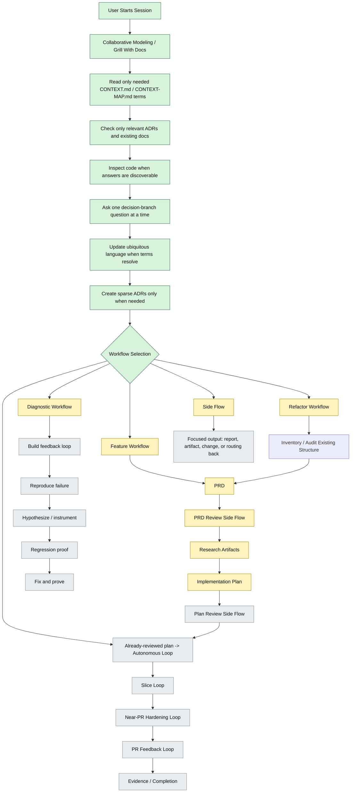

# Workflow Map Working Draft

This file exists so the workflow diagram can be edited as the shared
understanding changes.

## Status

This diagram is a working draft. It exposed a misunderstanding:

- `Setup Workspace`
- `Restore/Create Context`
- `Explore & Understand`
- `Workflow Entry Point`

These appeared in scaffold thinking and templates, but they were not defined
through shared understanding. The current resolution is that they disappear
entirely unless a concrete later need earns them back. **Collaborative
Modeling** is the entry point and **Workflow Selection** happens after enough
modeling to know what the model is working on.

The model should not load every possible workflow context up front. It should
begin with Collaborative Modeling, inspect only the context needed to understand
the user's intent, then route into the workflow or side flow that fits.

`discovery.md` disappeared as a named pre-phase, but the Planning with Files
idea still matters: discovery is file-backed across every phase. Findings,
questions, answers, evidence, and decisions should live in the relevant current
artifact instead of only in the model's context window.

## Current Diagram Under Review

## Questions Exposed

1. For diagnostic work, when does it use the full Collaborative Modeling path and when does it
   start directly from reproduction?
2. For side flows, when do they return to Collaborative Modeling versus
   producing a standalone artifact/change?

## Resolved

- Collaborative Modeling is the shared entry point.
- Workflow Selection follows Collaborative Modeling.
- The reason Workflow Selection comes after Collaborative Modeling is context
  control: the model should receive the context needed for the work, not every
  possible workflow context up front.
- `Setup Workspace`, `Restore/Create Context`, `Explore & Understand`, and
  `Workflow Entry Point` disappear as named phases unless a later concrete need
  earns them back.
- `discovery.md` disappears as a named pre-phase, but file-backed discovery
  remains a cross-phase practice.
