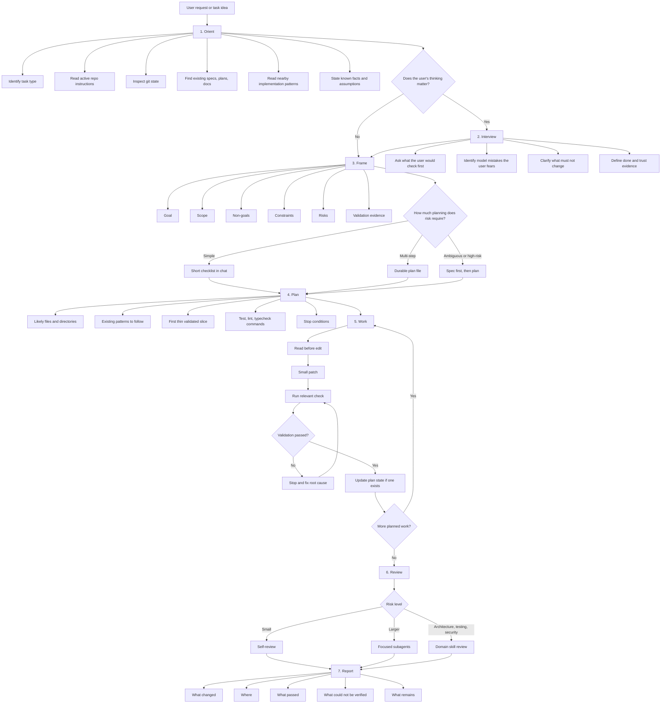
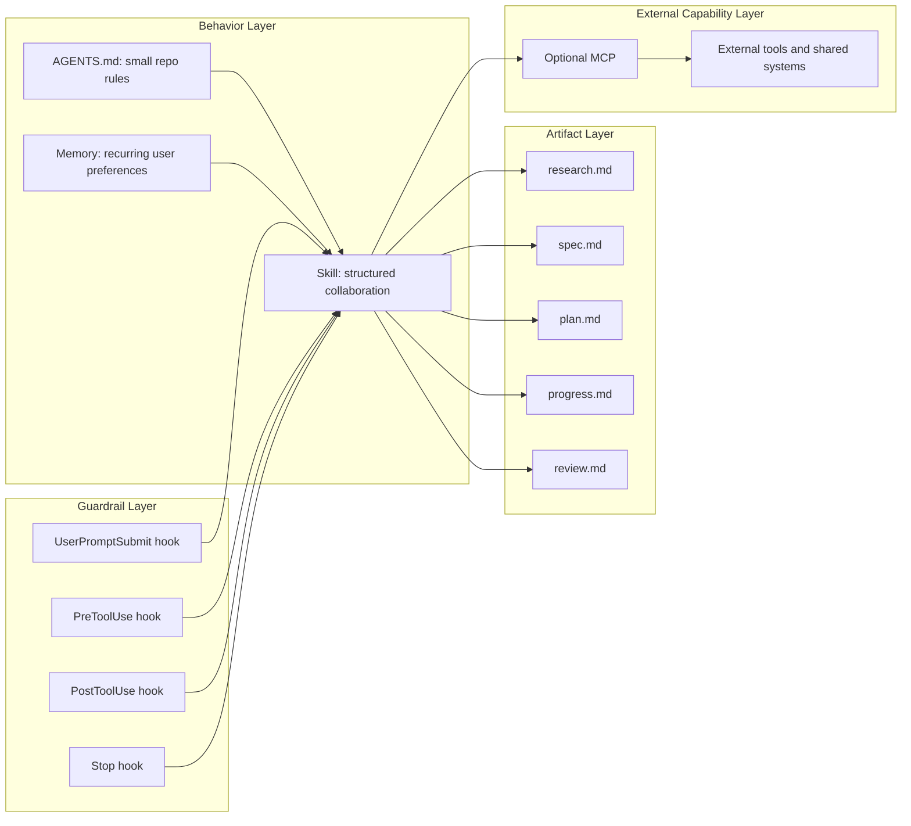

# Codex-First AI Collaboration Research

Date: 2026-05-02

## Purpose

This document collects the first research pass on reviving `structured-workflow-mcp` as a modern Codex-first collaboration system.

The original project was trying to solve a real failure mode: AI coding agents often jump from a vague request straight into edits, skip inventory, ignore existing architecture, accumulate broken tests, and then claim completion without evidence. The old MCP server tried to force a workflow gate. In practice, the current implementation is mostly guidance and self-reporting, not hard enforcement.

The opportunity in 2026 is to keep the original insight while using Codex-native primitives:

- `AGENTS.md` for small persistent repo rules.
- Skills for repeatable workflow doctrine.
- Plugins for distribution.
- Hooks for narrow guardrails and reminders.
- MCP only when the workflow needs external tools, shared systems, or cross-session state.

## Sources Read

Local repo:

- `README.md`
- `CODEX.md`
- `AGENTS.md`
- `CLAUDE.md`
- `docs/structured-workflow-mcp-v2.md`
- `docs/sample_prompts/*.md`
- `docs/test_prompt/*.md`
- `src/index.ts`
- `src/session/SessionManager.ts`
- `src/tools/*.ts`
- `src/workflows/*.ts`
- `src/types/index.ts`
- `src/utils/fileSystem.ts`
- selected tests under `src/**/__tests__`

Local workflow exemplars:

- VGV Wingspan: `plan`, `build`, `review`
- Agentic Coding Toolkit: `act-workflow-spec`, `act-workflow-plan`, `act-workflow-work`, `act-workflow-refine-spec`
- VGV Flutter plugin: TDD, testing, journey testing, layered architecture
- Superpowers: using-superpowers, brainstorming, writing-plans, executing-plans, subagent-driven-development, systematic-debugging, TDD, verification, review

Official OpenAI docs:

- [Codex Customization](https://developers.openai.com/codex/concepts/customization)
- [Codex Agent Skills](https://developers.openai.com/codex/skills)
- [Codex Hooks](https://developers.openai.com/codex/hooks)
- [Codex MCP](https://developers.openai.com/codex/mcp)
- [Codex Build Plugins](https://developers.openai.com/codex/plugins/build)
- [Codex Advanced Configuration](https://developers.openai.com/codex/config-advanced)
- [Codex Configuration Reference](https://developers.openai.com/codex/config-reference)

## Current Repo Diagnosis

The strongest idea in the current repo is not the MCP implementation. It is the workflow doctrine:

- Start with setup and scope.
- Audit existing code before changing it.
- Inventory likely changes.
- Compare implementation approaches.
- Ask questions and determine a plan.
- Write or refactor in small steps.
- Test and lint.
- Iterate until validation is clean.
- Present results with evidence.

The repo's own v2 document already names the right philosophical correction: "guide, don't gate." That is important. The server does not reliably gate normal agent behavior, and trying to make MCP do that job caused a mismatch between promise and runtime reality.

### What The MCP Server Actually Does

The server exposes MCP tools over stdio. It provides:

- Workflow entry tools: `refactor_workflow`, `create_feature_workflow`, `test_workflow`, `tdd_workflow`, `build_custom_workflow`.
- Phase guidance tools: setup, audit/inventory, compare/analyze, question/determine, refactor, test, lint, iterate, present.
- Validation tools: `validate_action`, `validate_phase_completion`.
- State/reporting tools: `workflow_status`, `phase_output`, `user_input_required_guidance`, `discover_workflow_tools`.

State is single-session and in memory. A new `startSession` overwrites the previous session, and the session is lost when the transport closes. The server has no persistent project database, no multi-client isolation, no resources, and no prompts.

### The Working Directory Problem Looks Real

There is strong evidence for the old working-directory problem:

- `--working-dir` only calls `process.chdir` during server startup.
- Relative output directories resolve against `process.cwd()`.
- Smithery exposes no config for working directory or output directory.
- If an MCP host starts the server from a cache, temp folder, home directory, or global install directory, the server's suggested artifact paths can point outside the user's actual project.

That means the old failure was not just "models behaved badly." The tool's execution context could disagree with the project context the user thought they were working in.

### Enforcement Is Mostly Voluntary

The server can only enforce read-before-write if the model voluntarily calls `validate_action`. It cannot intercept a normal Codex `apply_patch`, shell write, IDE edit, or other tool path. Similarly, phase order is not enforced: `phase_output` records whichever phase the model submits if the artifact content passes keyword checks.

Validation is also weak:

- Artifact validation checks length, JSON parsing, and phase keywords.
- `validate_phase_completion` uses exact string comparisons for created file paths.
- It can accept shallow artifacts that happen to contain the right words.
- It can reject valid work if equivalent paths do not exactly match expected strings.

The repo should stop describing this as hard enforcement unless real interception moves to Codex hooks or a host-level integration.

## What To Preserve

Preserve the human workflow insight, not the old mechanism.

### Audit Before Action

The core discipline is retrieval-led work. The agent should not guess repo architecture, dependencies, active plans, current tests, or user intent. It should read the nearest source of truth first.

For this project, that means the workflow should explicitly require:

- Active instructions: `AGENTS.md`, local docs, relevant nested guidance.
- Current repo state: dirty worktree, branch, package shape.
- Relevant implementation examples before new code.
- Test/lint/build commands before claiming a validation strategy.

### Plan As Shared Cognition

The useful artifact is not a long ritual document. It is a shared working model:

- What are we doing?
- What are we not doing?
- What files are involved?
- What is the first thin slice?
- What has to be true before we call it done?
- What evidence will prove that?

This is especially important for a self-taught programmer or a programmer crossing into a new domain. The plan is not just project management. It is a cognitive scaffold.

### Stop And Fix

The old repo correctly noticed that models accumulate failures. The modern workflow should make this explicit:

- If a validation command fails, stop.
- Read the failure.
- Diagnose root cause.
- Fix the smallest cause.
- Rerun the same relevant check.
- Only then continue.

This maps strongly to the Superpowers systematic-debugging skill and the ACT/VGV validation gates.

### Truthful Completion

No "done" without evidence. The final report should state:

- What changed.
- Where.
- What was validated.
- What failed and was fixed.
- What remains unvalidated or risky.

If a plan/checklist exists, it must match reality.

## Lessons From Other Workflow Systems

### Superpowers

Superpowers is sticky because it is unapologetically behavioral. It does not merely suggest "be careful"; it creates hard habits:

- Use the relevant skill first.
- Brainstorm before implementation.
- Ask one clarifying question at a time.
- Present alternatives and a recommendation.
- Write a design/spec.
- Write an implementation plan.
- Execute plan tasks in order.
- Verify before completion.
- Debug by root cause, not guesses.

The cost is weight. Superpowers is often too heavy as the default Codex path. Its lesson is not "make everything mandatory all the time." Its lesson is "make the workflow physically hard to skip when risk is high."

### VGV Wingspan

Wingspan is strong at lifecycle separation:

- Brainstorm.
- Plan.
- Build.
- Review.
- Ship.

It also has good Codex hygiene:

- Focused subagent prompts.
- No full conversation history in delegated tasks.
- Plans grounded in repo research.
- First thin validated slice.
- Review agents only when risk justifies them.

This is probably closest to the practical Codex shape for this project.

### Agentic Coding Toolkit

ACT is strong at explicit artifact contracts:

- Specs capture user flows, boundaries, edge cases, and done criteria.
- Plans are terse and execution-oriented.
- Work has hard invariants: plan truth, validation, no unchecked completion claims.

Its best transferable idea is the "plan truth" rule: if a plan exists, the plan is part of the system state. It must be reconciled with real work.

### VGV Flutter Plugin

The Flutter-specific guidance shows the value of companion domain skills:

- Architecture rules belong in domain skills.
- Test style belongs in testing skills.
- Workflow skills should call or defer to domain skills rather than duplicating everything.

For this repo, the structured workflow should not become one giant omniscient skill. It should be a router and discipline layer that can pair with domain skills.

### Planning With Files

I did not find a local Planning-with-Files skill in the current searchable skill/plugin paths. The concept still matters because the user identified it as effective. The likely transferable pattern is:

- Externalize thinking into repo-local files.
- Keep state durable across turns and agents.
- Make planning artifacts inspectable and revisable.
- Use files as shared memory rather than relying on chat history.

This should be validated by interviewing the user and, if available, reading the actual skill source in a later pass.

## OpenAI/Codex Platform Mapping

OpenAI's current Codex docs describe these layers as complementary:

- `AGENTS.md` shapes durable project guidance.
- Skills package repeatable workflows and domain expertise.
- Plugins are the installable distribution unit for reusable skills, apps, MCP config, and hooks.
- MCP connects Codex to outside tools and shared systems.
- Hooks inject lifecycle scripts into the agentic loop.
- Project `.codex/config.toml` and `.codex/hooks.json` can be repo-local when the project is trusted.

The docs also matter for the old cwd failure:

- Codex MCP config supports `mcp_servers.<id>.cwd`.
- Project config is loaded only in trusted projects.
- Hooks receive the session `cwd`.
- Hook docs recommend resolving repo-local scripts from `git rev-parse --show-toplevel` instead of assuming a relative path.

## Recommended Direction

Build this as a Codex plugin whose primary payload is a small set of skills. Add hooks only for narrow guardrails. Keep MCP optional.

### Phase 1: Repo-Local Research Artifacts

Current task.

Outputs:

- This synthesis file.
- Interview guide.
- Later: a sharper product spec.

### Phase 2: Create A Repo-Local Skill Prototype

Create `.agents/skills/structured-collaboration/SKILL.md` or a plugin folder under `plugins/structured-collaboration`.

The first skill should be instruction-only. Avoid scripts at first. The workflow is still being shaped.

Suggested skill name:

```text
structured-collaboration
```

Suggested trigger:

```text
Use when the user wants disciplined AI collaboration for programming, planning, debugging, refactoring, or multi-step implementation work, especially when the task requires retrieval-led reasoning, shared planning artifacts, validation gates, or interview-driven clarification.
```

Core modes:

- `orient`: inspect repo docs, current state, active task, existing plans.
- `interview`: ask the user how they think through this task.
- `spec`: turn fuzzy intent into a shared artifact.
- `plan`: make an execution plan with files, validation, risks, and first slice.
- `work`: implement in small validated steps.
- `debug`: root-cause investigation before fixes.
- `review`: adversarial quality pass.
- `ship`: commit/push/PR handoff if requested.

### Phase 3: Package As A Plugin

Use a plugin when the workflow is stable enough to share.

Minimum plugin shape:

```text
plugins/structured-collaboration/
  .codex-plugin/plugin.json
  skills/
    structured-collaboration/
      SKILL.md
    structured-debugging/
      SKILL.md
    structured-planning/
      SKILL.md
```

Add a repo marketplace only when local testing is useful:

```text
.agents/plugins/marketplace.json
```

### Phase 4: Add Hooks For Narrow Guardrails

Do not try to rebuild the MCP gate in hooks. Use hooks for narrow, observable moments:

- `UserPromptSubmit`: detect "fix/build/implement" prompts and add context reminding Codex to use the structured skill when the task is non-trivial.
- `PreToolUse` for `apply_patch`: warn or block when no file-read evidence exists in the current turn or when a plan-required phase is being skipped. This needs careful design because hook interception is incomplete and should not pretend to be total security.
- `PostToolUse`: if a validation command fails, inject a stop-and-fix reminder.
- `Stop`: if the last assistant message claims completion without validation evidence, continue the turn with a prompt to verify or disclose the gap.

Hooks should use `cwd` and `git rev-parse --show-toplevel` to avoid the old project-root mismatch.

### Phase 5: Keep MCP Only If It Adds Real Value

MCP may still be useful, but not as the main workflow enforcement surface.

Good MCP uses:

- Store structured workflow state if Codex hooks/skills are insufficient.
- Expose workflow artifacts as resources.
- Provide cross-tool project context.
- Connect to issue trackers, docs, or external research tools.
- Provide a test harness for workflow evaluation.

Bad MCP uses:

- Pretending to block normal file edits.
- Maintaining a separate cwd that can drift from the project.
- Forcing the model to call tools just to prove it is "disciplined."

## Product Shape Hypothesis

The product should help a developer and model become "of the same mind" by externalizing shared working habits.

It should feel like a collaborative discipline system, not a compliance cage.

Core promise:

> AI coding help that slows down in the places humans slow down: orienting, comparing approaches, checking assumptions, testing evidence, and revising when reality disagrees.

Target users:

- Self-taught developers.
- Domain experts learning programming.
- Students using AI without wanting to surrender understanding.
- Small app builders who need production discipline without a formal engineering team.
- Expert developers who want their preferred workflow to survive across models and tools.

Differentiator:

- Not "AI writes code faster."
- "AI collaborates in a way that teaches, preserves intent, and reduces chaos."

## Proposed Workflow Doctrine

### Structured Diagram

This diagram extracts the workflow ideas into a structured sequence while preserving the full text below as the source detail.





### 1. Orient

Before advice or edits:

- Identify the task type.
- Read active repo instructions.
- Inspect current git state.
- Find existing specs/plans/docs.
- Read nearby implementation patterns.
- State what is known and what is assumed.

### 2. Interview

If the user's thinking matters, ask targeted questions:

- What would you check first if doing this manually?
- What mistakes are you worried the model will make?
- What must not change?
- What does "done" look like?
- What would make you trust the result?

### 3. Frame

Convert the task into:

- Goal.
- Scope.
- Non-goals.
- Constraints.
- Risks.
- Validation evidence.

### 4. Plan

Plan only as much as risk requires:

- Simple task: short checklist in chat.
- Multi-step task: durable plan file.
- Ambiguous/high-risk task: spec first, then plan.

Every plan should include:

- Files/directories likely touched.
- Existing patterns to follow.
- First thin validated slice.
- Test/lint/typecheck commands.
- Stop conditions.

### 5. Work

Implementation discipline:

- Read before edit.
- Small patch.
- Run relevant check.
- Stop and fix on failure.
- Update plan state if one exists.

### 6. Review

Review depth scales with risk:

- Self-review for small changes.
- Focused subagents for larger work.
- Domain skill review when architecture/testing/security matters.

### 7. Report

Final answer:

- What changed.
- Where.
- What passed.
- What could not be verified.
- What remains.

## What To Change In This Repo Later

If the repo continues as an MCP server:

- Add `prepack` or `prepare` so `dist/` is built for package consumers.
- Add Smithery config schema for `workingDirectory` and `outputDirectory`.
- Return explicit `projectDirectory` and `serverCwd` in workflow startup.
- Refuse relative output dirs unless a project root is explicit.
- Normalize artifact paths and stop discarding user-provided artifact identifiers silently.
- Make phase order validation real or remove "cannot skip phases" claims.
- Replace keyword artifact validation with structured schemas per phase.
- Add stdio integration tests for `tools/list`, `tools/call`, cwd behavior, and Smithery startup.

If the repo becomes a Codex skill/plugin:

- Archive or demote the old MCP server docs.
- Write a fresh `README.md` around Codex skills/plugins/hooks.
- Add `.codex-plugin/plugin.json`.
- Add `skills/structured-collaboration/SKILL.md`.
- Add evaluation prompts for the skill test tool.
- Keep MCP as optional advanced integration.

## Open Questions

- What does the user personally do first when facing a programming task: search, sketch, run tests, inspect docs, draw diagrams, or ask questions?
- Which parts of Superpowers feel essential versus too heavy?
- Which parts of Planning with Files were effective: file layout, checkpoints, prompt style, status tracking, or artifact permanence?
- Should the first product be personal and local, or immediately shareable?
- What should be the minimum viable skill test?
- How strict should hooks be allowed to be before they become annoying?
- Should artifacts live under `docs/research`, `docs/plans`, `docs/superpowers`, `ai_specs`, or a new neutral folder?

## Initial Recommendation

Start with an instruction-only Codex skill and a research/interview cycle. Do not rewrite the MCP server first.

Reason:

- The important part is the collaboration doctrine.
- Codex skills are the native reusable workflow format.
- Plugins can distribute the skill when stable.
- Hooks can add guardrails where Codex actually exposes lifecycle events.
- MCP remains useful, but only after the workflow state and external-tool needs are clear.

The first build should be a small repo-local skill that changes Codex behavior in this repo. Then test it with the skill test tool and compare against the old MCP prompts.
